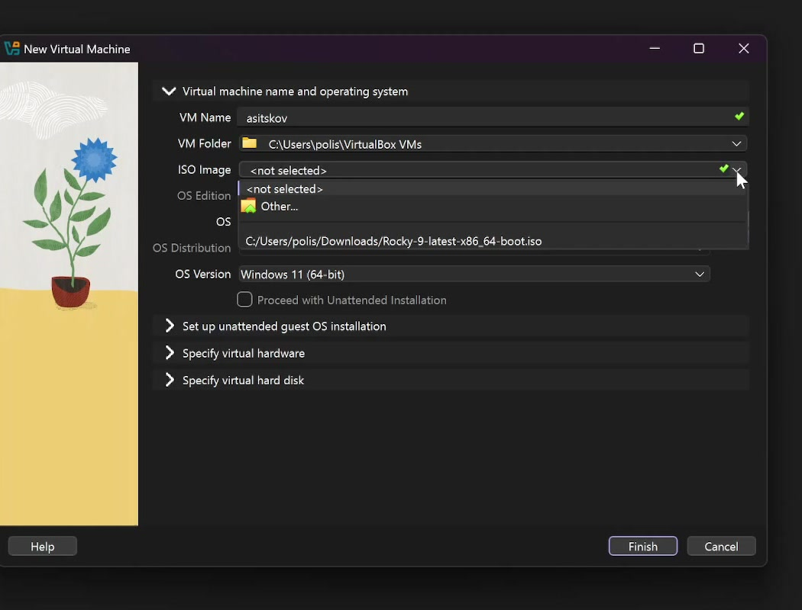
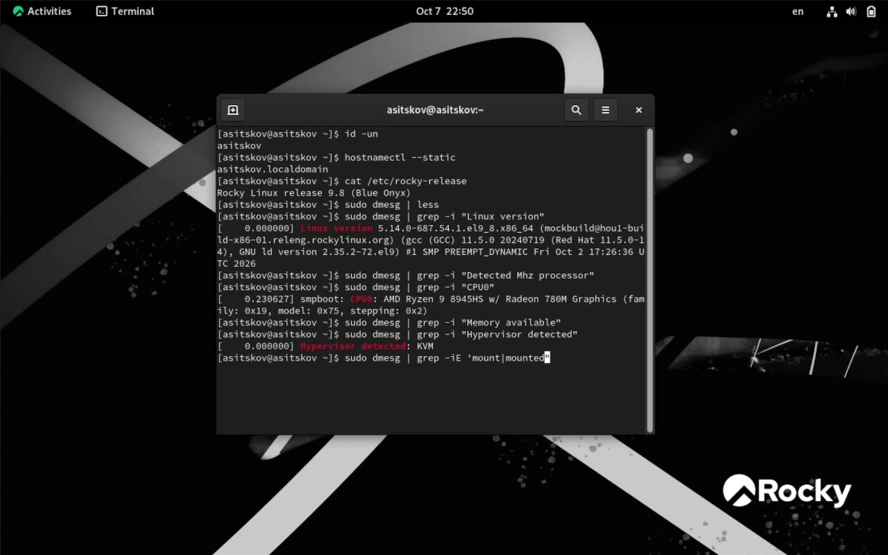
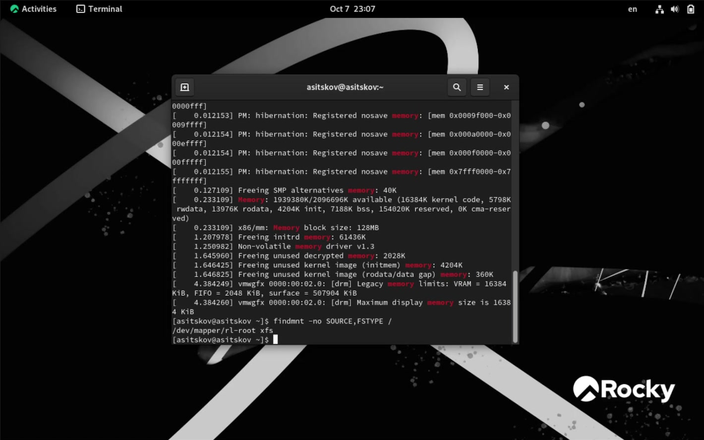

## Докладчик

::: columns
::: {.column width="42%"}
{fig-alt="Портрет докладчика" width=85%}
:::

::: {.column width="58%"}
**Ицков Андрей Станиславович**\
Студент группы НФИбд-03-24\
Логин в лабораторной: `asitskov`

**Научный руководитель**\
Кулябов Дмитрий Сергеевич, д.ф.-м.н., профессор кафедры теории вероятностей и кибербезопасности
:::
:::

## Актуальность, объект и предмет

- **Актуальность:** виртуальная машина даёт изолированную среду для установки и исследования ОС без изменения физического диска.
- **Объект:** процесс загрузки и базовая конфигурация Linux-системы.
- **Предмет:** параметры гостевой ОС, которые можно установить по журналу ядра и сведениям о монтировании.
- **Новизна работы:** сопоставлены сообщения ядра о загрузке с фактическим источником и типом корневой ФС виртуальной машины.
- **Практическая значимость:** полученные команды пригодны для первичной диагностики Linux.

## Цель, гипотеза и задачи

- **Цель:** установить Rocky Linux в VirtualBox и исследовать основные параметры гостевой системы.
- **Гипотеза:** журнал `dmesg` и команда `findmnt` позволяют определить ключевые сведения о загрузке, виртуальном оборудовании и корневой ФС.
- Создать ВМ и установить систему с графической средой.
- Настроить hostname, пользователя и Guest Additions.
- Проверить ядро, CPU, память, гипервизор и файловые системы.

## Средства и методы

- **Средства:** VirtualBox 7.2.16 [1], Rocky Linux 9.8 [2], терминал гостевой системы.
- **Конфигурация:** 2 ГиБ RAM, динамический виртуальный диск 40 ГБ, сетевой режим NAT.
- **Методы:** установка ОС; проверка учётной записи и hostname; фильтрация сообщений `dmesg`; просмотр точки `/` через `findmnt`.
- Теоретическая основа: виртуализация отделяет гостевую ОС от физического оборудования и предоставляет ей виртуальные устройства [3]. Методика — указания курса [4].

## Создание виртуальной машины

::: columns
::: {.column width="43%"}
- Тип ОС: Red Hat (64-bit)
- ОЗУ: 2048 МБ
- Диск VDI: до 40 ГБ
- Сеть: NAT
:::

::: {.column width="57%"}
{width=100%}
:::
:::

## Установка и первичная настройка

::: columns
::: {.column width="43%"}
- Установлена Rocky Linux 9.8 с графической средой [2].
- Hostname: `asitskov.localdomain`.
- Администратор: `asitskov`.
- Установлены Guest Additions, затем выполнена перезагрузка.
:::

::: {.column width="57%"}
{width=100%}
:::
:::

## Идентификация и версия ОС

::: columns
::: {.column width="42%"}
- Пользователь: `asitskov`
- Hostname: `asitskov.localdomain`
- Rocky Linux 9.8 (Blue Onyx)
- Ядро: `5.14.0-687.54.1.el9_8.x86_64`
:::

::: {.column width="58%"}
{width=100%}
:::
:::

## CPU, память и гипервизор

::: columns
::: {.column width="48%"}
- CPU: AMD Ryzen 9 8945HS с Radeon 780M.
- Частота в сообщении загрузки: 3992,526 МГц.
- Ядро обнаружило интерфейс гипервизора KVM.
- Доступно при загрузке: 1 939 380 КБ из 2 096 696 КБ.
:::

::: {.column width="52%"}
{width=100%}
:::
:::

## Корневая файловая система

::: columns
::: {.column width="48%"}
- `findmnt` подтвердил источник `/dev/mapper/rl-root`.
- Тип корневой ФС — XFS.
- В `dmesg` после корневой ФС видны `hugetlbfs`, `mqueue`, `debugfs`, `tracefs`.
- Последовательность сообщений не равна полной хронологии всех служб ОС.
:::

::: {.column width="52%"}
{width=100%}
:::
:::

## Результаты и практический смысл

- Установка и настройка гостевой ОС завершены; имя пользователя и hostname соответствуют логину `asitskov`.
- Проверки подтвердили ожидаемую конфигурацию: ядро Rocky Linux 9.8, 2 ГиБ выделенной RAM и корень XFS.
- `dmesg` показывает сведения, зарегистрированные ядром при загрузке; результаты относятся к виртуальной машине.
- `findmnt` удобнее для проверки текущего источника и типа ФС, чем попытка восстановить их только по журналу загрузки.

## Вывод и источники

Цель достигнута: Rocky Linux 9.8 установлена в VirtualBox, базовая конфигурация проверена. Гипотеза подтвердилась для поставленных параметров: `dmesg` и `findmnt` дали необходимые сведения о ядре, виртуальном оборудовании, памяти и корневой ФС.

1. Oracle. *Oracle VM VirtualBox User Manual*.
2. Rocky Linux Documentation. *Rocky Linux Documentation*.
3. Таненбаум Э., Бос Х. *Современные операционные системы*.
4. Методические указания к лабораторной работе № 1 «Установка и конфигурация ОС на виртуальную машину».
