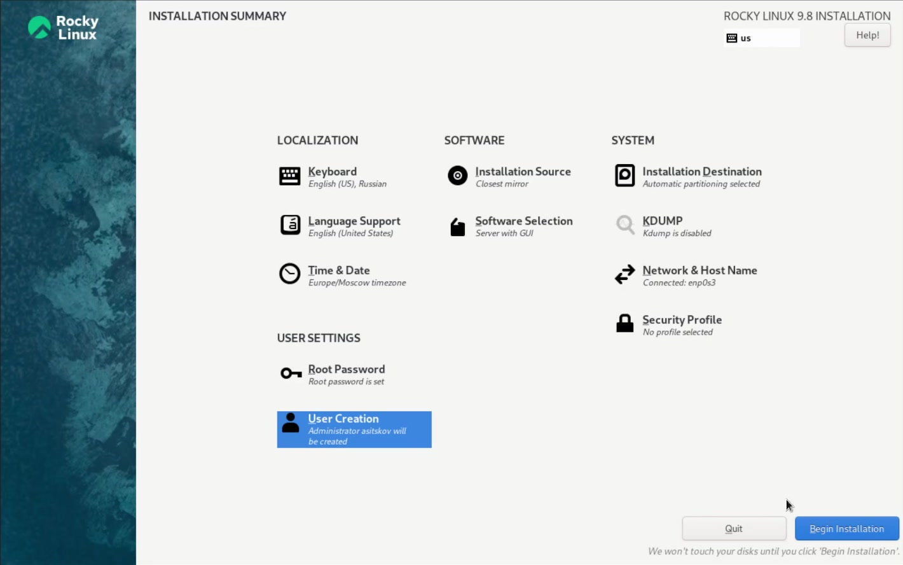
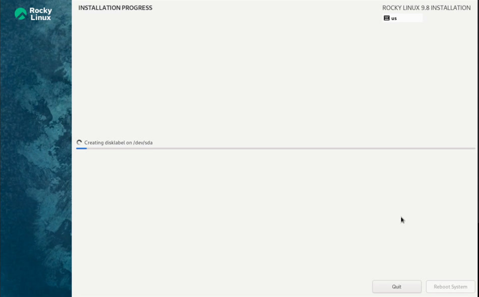
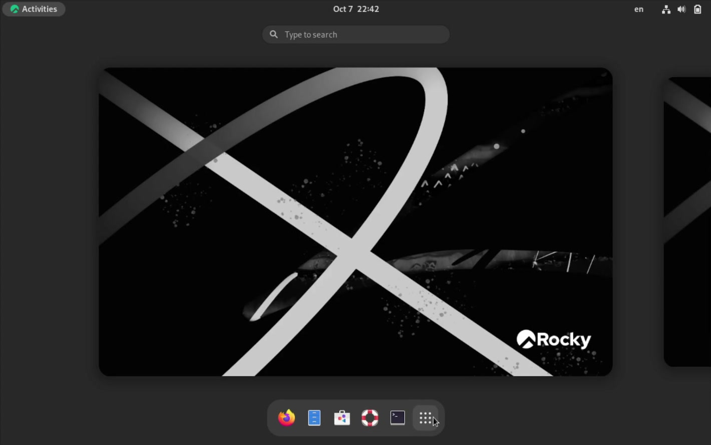
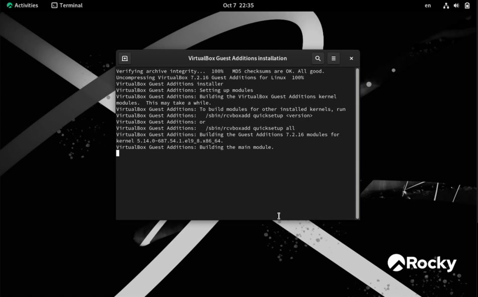
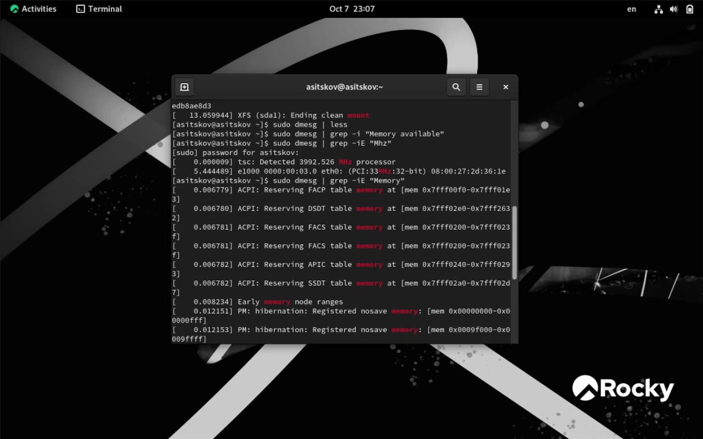
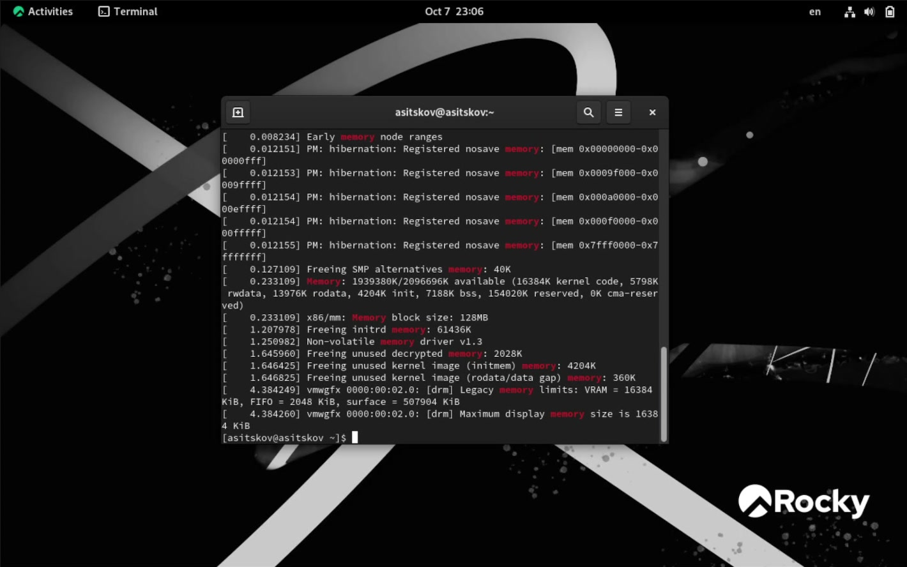
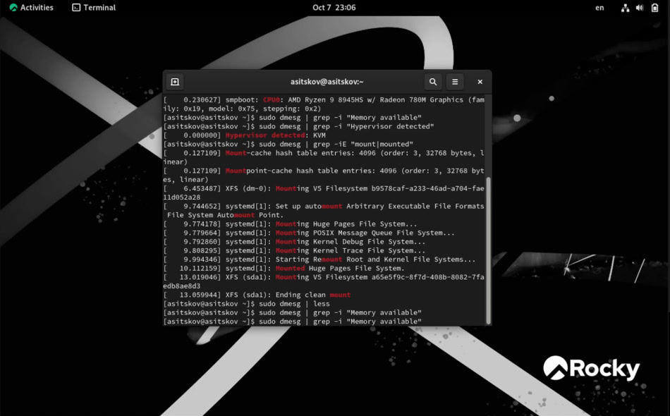

\newpage

```{=openxml}
<w:p><w:r><w:br w:type="page"/></w:r></w:p>
```

# Введение

## Цель работы

Установить операционную систему Linux на виртуальную машину, настроить минимально необходимые параметры и службы, а также изучить сообщения ядра при загрузке.

## Задание

Создать виртуальную машину с Linux, установить Rocky Linux с графической средой, настроить имя компьютера и пользовательскую учётную запись, установить VirtualBox Guest Additions. По журналу ядра определить версию ядра, частоту и модель процессора, объём доступной памяти, обнаруженный гипервизор, тип корневой файловой системы и последовательность монтирования файловых систем.

## Теоретическое введение

Виртуальная машина предоставляет гостевой операционной системе виртуальные процессор, оперативную память, диск и сетевой адаптер. Гостевая ОС работает изолированно от основной, а её виртуальный диск хранится в виде файла на хосте. Такой стенд позволяет безопасно изучать установку и администрирование ОС без переразметки физического диска [@oracle_virtualbox_manual].

Rocky Linux — дистрибутив Linux корпоративного класса [@rocky_linux_docs]. Ядро Linux при загрузке обнаруживает оборудование и гипервизор, инициализирует память и драйверы, затем монтирует корневую файловую систему и передаёт управление системе инициализации. Команда `dmesg` показывает буфер сообщений ядра; `findmnt` позволяет проверить источник и тип файловой системы, смонтированной в заданную точку. Общие принципы ОС и файловых систем рассматриваются в [@tanenbaum_book_modern-os_ru]. Методические требования к работе приведены в задании курса [@rudn_lab_virtualbox].

# Выполнение лабораторной работы

## Создание виртуальной машины

В VirtualBox 7.2.16 создана виртуальная машина `asitskov` типа Red Hat (64-bit). Для неё выделено 2048 МБ оперативной памяти; создан виртуальный диск VDI максимальным размером 40 ГБ. В качестве сетевого подключения оставлен NAT. К виртуальному оптическому приводу подключён загрузочный образ Rocky Linux 9. Основные параметры новой ВМ показаны на @fig-vm.

{#fig-vm width=95%}

## Установка и первоначальная настройка

Установка выполнена на единственный виртуальный диск. Конфигурация перед началом установки показана на @fig-install, ход установки — на @fig-install-progress. В ходе установки настроены сеть и имя узла `asitskov.localdomain`, создан администратор `asitskov`. После завершения установки система загрузилась в графическую среду Rocky Linux (@fig-desktop). Затем были установлены VirtualBox Guest Additions (@fig-ga) и выполнена перезагрузка.

{#fig-install width=95%}

{#fig-install-progress width=95%}

{#fig-desktop width=95%}

{#fig-ga width=95%}

## Проверка установленной системы

Для проверки пользователя, имени узла и выпуска ОС выполнены команды:

```bash
id -un
hostnamectl --static
cat /etc/rocky-release
```

На @fig-identity показаны значения `asitskov`, `asitskov.localdomain` и `Rocky Linux release 9.8 (Blue Onyx)`. Команда `sudo dmesg | grep -i "Linux version"` показала ядро `5.14.0-687.54.1.el9_8.x86_64`.

{#fig-identity width=95%}

## Анализ загрузки и оборудования

Для поиска сведений в буфере ядра использовались `sudo dmesg | less` и фильтрация `grep`. В частности, строка `tsc: Detected 3992.526 MHz processor` показывает обнаруженную при загрузке частоту около 3,99 ГГц. Она относится к сообщению виртуальной машины и не является гарантированной постоянной частотой процессора.

В строке `CPU0` указан процессор `AMD Ryzen 9 8945HS w/ Radeon 780M Graphics`. Сообщение `Hypervisor detected: KVM` показывает интерфейс гипервизора, предоставленный виртуальной машине. Для виртуальной машины это ожидаемое представление KVM-паравиртуализации VirtualBox.

В `dmesg` найдено сообщение `Memory: 1939380K/2096696K available` (@fig-memory); таким образом, на момент загрузки ядро сообщило примерно о 1,85 ГиБ доступной памяти из выделенных виртуальной машине 2 ГиБ. Результат может меняться в зависимости от занятой ядром памяти. Модель CPU и обнаруженная частота показаны на @fig-cpu.

{#fig-cpu width=95%}

{#fig-memory width=95%}

По `dmesg` видны сообщения о монтировании корневой XFS, а затем служебных файловых систем `hugetlbfs`, `mqueue`, `debugfs` и `tracefs` (@fig-mounts); также выполняется перемонтирование корня и системных файловых систем. Вывод `findmnt -no SOURCE,FSTYPE /` подтвердил, что точка `/` использует логический том `/dev/mapper/rl-root` с файловой системой `xfs` (@fig-rootfs).

{#fig-mounts width=95%}

{#fig-rootfs width=95%}

# Результаты и контрольные вопросы

## Контрольные вопросы

### Какие сведения содержит учётная запись пользователя?

Запись пользователя связывает имя входа с числовыми UID и основным GID, содержит поле комментария, путь к домашнему каталогу и командную оболочку. В `/etc/passwd` хранится общедоступная часть записи, а защищённый хеш пароля — отдельно в `/etc/shadow`. Дополнительные группы задаются отдельно.

### Какие команды используются для справки, навигации, работы с каталогами, правами и историей?

- Справка: `man команда`, `команда --help`, `info команда`.
- Текущий каталог и переход: `pwd`, `cd путь`, `cd ..`, `cd ~`.
- Просмотр содержимого и размера: `ls -la`, `du -sh каталог`.
- Создание и удаление: `mkdir каталог`, `touch файл`, `rm файл`, `rmdir пустой_каталог`; `rm -r каталог` удаляет дерево каталогов, поэтому требует осторожности.
- Изменение прав: `chmod режим файл`, например `chmod u+x script.sh`.
- История команд: `history`; повтор команды — `!номер`.

### Что такое файловая система? Приведите примеры.

Файловая система — способ организации данных и метаданных на носителе: имён и каталогов, прав доступа, расположения блоков и свободного места. Примеры: XFS и ext4 в Linux, Btrfs, FAT32 и NTFS.

### Как посмотреть смонтированные файловые системы?

Для дерева точек монтирования используется `findmnt`; `mount` показывает активные монтирования, а `df -hT` — тип файловой системы и занятое место. Чтобы проверить корень в этой работе, использована команда `findmnt -no SOURCE,FSTYPE /`.

### Как завершить зависший процесс?

Сначала процесс находят, например, командой `ps aux` или `pgrep -a имя`. Затем ему отправляют обычный сигнал завершения: `kill PID` (SIGTERM), позволяющий корректно закрыться. Если процесс не реагирует, применяют `kill -KILL PID` (или `kill -9 PID`) как крайнюю меру.

## Домашнее задание

Результаты анализа журнала ядра:

| Параметр | Результат |
|---|---|
| Выпуск ОС | Rocky Linux 9.8 (Blue Onyx) |
| Ядро Linux | `5.14.0-687.54.1.el9_8.x86_64` |
| Частота, обнаруженная при загрузке | `3992.526 MHz` (около 3,99 ГГц) |
| Модель CPU | AMD Ryzen 9 8945HS w/ Radeon 780M Graphics |
| Доступная память при загрузке | `1939380K` из `2096696K`, около 1,85 ГиБ |
| Обнаруженный интерфейс гипервизора | KVM |
| Корневая файловая система | `/dev/mapper/rl-root`, XFS |
| Порядок сообщений о монтировании | корневая XFS; затем `hugetlbfs`, `mqueue`, `debugfs`, `tracefs`; далее перемонтирование корня и системных файловых систем |

Частота найдена фильтром `sudo dmesg | grep -iE 'Detected .* MHz processor'`. Ранее использованный шаблон `Detected Mhz processor` не совпал со строкой журнала, поскольку фактический вывод содержит числовое значение между словами `Detected` и `MHz`.

## Выводы

В ходе лабораторной работы создана виртуальная машина с Rocky Linux 9.8, настроены имя узла и учётная запись администратора, установлены Guest Additions. Команды `dmesg` и `findmnt` позволили исследовать параметры ядра, процессора, памяти, гипервизора, монтирования и тип корневой файловой системы. Цель работы достигнута.

## Отклонения от методических указаний

Работа выполнена на личном ноутбуке под Windows 11, а не на компьютере дисплейного класса. Методические указания допускают домашнее выполнение; внутри виртуальной машины установлена Rocky Linux и выполнены те же основные действия. Иных отступлений, влияющих на полученные результаты, не было.

## Приложение. Изменённые файлы

В гостевой системе не создавались и не изменялись файлы задания: лабораторная работа состояла из установки и настройки ОС, запуска диагностических команд и анализа их вывода. Файлы отчёта и презентации подготовлены отдельно на хостовой системе.

## Список литературы {.unnumbered}

::: {#refs}
:::
