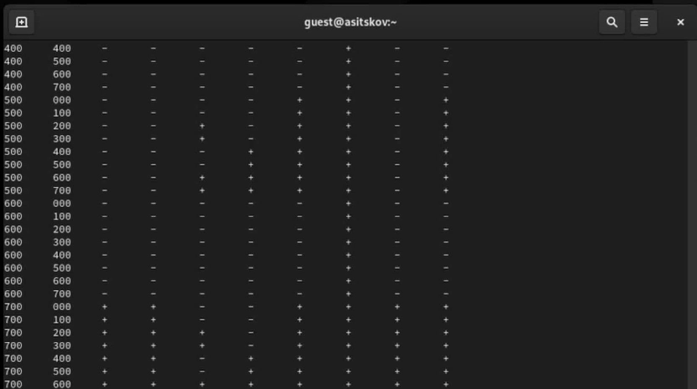

## Докладчик

::: columns
::: {.column width="42%"}
{fig-alt="Портрет докладчика" width=78%}
:::
::: {.column width="58%"}
**Ицков Андрей Станиславович**  
Студент группы НФИбд-03-24  
Логин в лабораторной: `guest`

**Преподаватель**  
Кулябов Дмитрий Сергеевич, д.ф.-м.н., профессор кафедры теории вероятностей и кибербезопасности
:::
:::

## Актуальность и постановка задачи

- Права доступа в Linux определяют, кто может обращаться к файлам и каталогам.
- У каталогов и обычных файлов одинаковые буквы `rwx`, но смысл отдельных битов различается.
- Нужно экспериментально проверить все 64 сочетания трёх битов владельца для каталога и файла.
- Результаты используются для определения минимальных прав на типовые операции [@rudn_lab_discretionary].

## Цель, гипотеза и задачи

- **Цель:** изучить основные атрибуты объектов файловой системы и правила DAC в Linux.
- **Гипотеза:** доступ к файлу зависит одновременно от прав самого файла и прохода по содержащему каталогу.
- Создать учётную запись `guest`, сверить UID/GID и группы.
- Проверить режим каталога до и после `chmod 000`.
- Сопоставить права владельца каталога и файла для 64 комбинаций; вывести минимальные права для семи операций.

## Как читаются права

- `r=4`, `w=2`, `x=1`; режим `700` даёт владельцу `rwx`, `000` снимает права у всех классов [@linux_chmod].
- Для каталога `x` означает проход/поиск, `r` — список имён, `w` — изменение записей.
- Для файла `r` открывает чтение содержимого, `w` разрешает его изменить.
- Удаление и переименование обычно определяются правами родительского каталога [@linux_path_resolution; @linux_unlink; @linux_rename].

## Среда и ход опыта

::: {.columns}
::: {.column width="56%"}

- Rocky Linux 9.8 в VirtualBox; работа от пользователя `guest`.
- UID и GID — `1001`; домашний каталог — `/home/guest`.
- В `/home` видны каталоги `asitskov` и `guest` с режимом `700`.
- `guest` проверил расширенные атрибуты собственного каталога.

:::
::: {.column width="44%"}

{fig-alt="Список /home и проверка расширенных атрибутов" width=100%}

:::
:::

## Режим каталога 000

::: {.columns}
::: {.column width="56%"}

- `chmod 000 dir1` снимает права владельца, группы и остальных.
- `ls -ld dir1` показывает `d---------`.
- Для прохода по каталогу требуется `x`; для просмотра имён — `r`.
- После проверки права восстановлены командой `chmod 700 dir1`.

:::
::: {.column width="44%"}

{fig-alt="Вывод ls -ld после chmod 000" width=100%}

:::
:::

## Матрица 2.1: 64 комбинации

::: {.columns}
::: {.column width="56%"}

- Маски владельца каталога и файла: `000`, `100`, `200`, `300`, `400`, `500`, `600`, `700`.
- Всего проверено `8 × 8 = 64` сочетания.
- `w+x` каталога разрешают менять его записи.
- Для чтения и записи файла нужны `x` каталога и `r` или `w` файла.
- Полная матрица приведена в `lab02-table21.tsv`.

:::
::: {.column width="44%"}

{fig-alt="Фрагмент матрицы 2.1" width=100%}

:::
:::

## Минимальные права: таблица 2.2

| Операция | Каталог | Файл / подкаталог |
|:--|:--:|:--:|
| Создать / удалить / переименовать файл | `wx` | — |
| Читать файл | `x` | `r` |
| Записать в файл | `x` | `w` |
| Создать подкаталог | `wx` | — |
| Удалить пустой подкаталог | `wx` родителя | — |

## Выводы

- `x` каталога открывает проход; `r` показывает имена; `w+x` меняют содержимое списка записей.
- Для содержимого обычного файла нужны `r` для чтения и `w` для записи.
- Удаление файла возможно без права `w` на самом файле, если разрешено менять родительский каталог.
- Матрица заполнена для прав владельца; ACL, sticky bit и права группы/остальных не исследовались.

## Источники

- Методические указания к лабораторной работе № 2 [@rudn_lab_discretionary].
- Linux man-pages: `chmod(1)`, `path_resolution(7)`, `unlink(2)`, `rename(2)` [@linux_chmod; @linux_path_resolution; @linux_unlink; @linux_rename].

