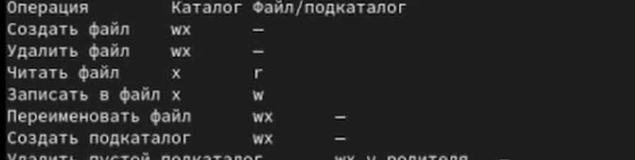

\newpage

```{=openxml}
<w:p><w:r><w:br w:type="page"/></w:r></w:p>
```

# Введение {.unnumbered}
## Цель работы {.unnumbered}

Получить практические навыки работы в консоли с атрибутами файлов и закрепить основы дискреционного разграничения доступа в Linux. Исследуется, как три бита владельца (`r`, `w`, `x`) для каталога и файла влияют на доступ к объектам и выполнение операций.

## Задание {.unnumbered}

Создать учётную запись `guest`, изучить её идентификаторы и домашний каталог, проверить обычные и расширенные атрибуты каталогов, проверить изменение режима каталога после `chmod 000`, опытным путём заполнить таблицу 2.1 для 64 сочетаний прав владельца и определить минимальные права для операций таблицы 2.2 [@rudn_lab_discretionary].

# Теоретическое введение

В Linux права доступа задаются для владельца, группы и остальных пользователей. Для каждого класса используются биты чтения (`r`), записи (`w`) и выполнения (`x`). В числовой записи значения `r=4`, `w=2`, `x=1`; режим `700` означает `rwx------`, а `000` снимает биты во всех трёх классах [@linux_chmod].

Смысл битов зависит от типа объекта. Для обычного файла `r` разрешает читать содержимое, `w` — изменять его, `x` — запускать файл как программу. Для каталога `x` даёт право прохода и поиска имени, `r` — просмотр списка имён, `w` — изменение записей каталога. Удаление и переименование обычно определяются правами на содержащий каталог, а доступ к пути требует прохода по каждому родительскому каталогу [@linux_path_resolution; @linux_unlink; @linux_rename].

Эксперимент ограничен тремя битами владельца для каталога и файла: 8 × 8 = 64 комбинации. Владелец обоих объектов — `guest`; проверки выполнялись без привилегий `root`. Расширенные атрибуты inode проверялись отдельно командой `lsattr`.

# Выполнение лабораторной работы

## Учётная запись и группы

Виртуальная машина — Rocky Linux 9.8 из лабораторной работы № 1. Администратор создал пользователя `guest`, задал пароль и выполнил вход в графическую сессию. Пароль в отчёт не включён. Проверены имя пользователя, UID/GID и запись в `/etc/passwd`:

```bash
whoami
id
groups
grep '^guest:' /etc/passwd
```

В приглашении терминала отображается `[guest@asitskov ~]$`; `whoami` показывает `guest`. Команда `id` сообщает `uid=1001(guest) gid=1001(guest) groups=1001(guest)`, что совпадает с записью `/etc/passwd` и выводом `groups`. Символ `~` соответствует домашнему каталогу `/home/guest`.

## Каталоги `/home` и расширенные атрибуты

Список подкаталогов и их обычные права проверены командами:

```bash
ls -l /home/
lsattr /home
```

В `/home` видны каталоги `asitskov` и `guest`; оба имеют режим `drwx------` (700). `guest` прочитал расширенные атрибуты собственного каталога `/home/guest`. Для `/home/asitskov` команда `lsattr` вернула `Permission denied`: у `guest` нет прохода к чужому домашнему каталогу. Отказ доступа сам по себе не свидетельствует об особом расширенном атрибуте.

## Создание `dir1` и проверка `chmod 000`

В домашнем каталоге создан `dir1`; при стандартной маске `umask 022` начальный режим составил `755` (`drwxr-xr-x`). Команда `lsattr -d dir1` не показала установленных флагов. После `chmod 000 dir1` команда `ls -ld dir1` показала `d---------`. После проверки права каталога восстановлены командой `chmod 700 dir1`.

{#fig-home-dir1 width=95%}

{#fig-dir1-mode width=95%}

## Опытная проверка сочетаний прав

Для таблицы 2.1 проверялись 8 масок владельца каталога и 8 масок владельца файла: `000`, `100`, `200`, `300`, `400`, `500`, `600`, `700`. В каждой строке `+` означает доступность операции владельцу, `-` — отказ. В столбцах `dir` и `file` записана маска владельца; `create`, `delete`, `write`, `read`, `cd`, `list`, `rename`, `chmod` соответствуют созданию файла, удалению файла, записи, чтению, проходу в каталог, просмотру имён, переименованию и смене режима файла. Полные 64 результата приведены в @tbl-matrix.

\clearpage


| dir | file | create | delete | write | read | cd | list | rename | chmod |
|:---:|:---:|:---:|:---:|:---:|:---:|:---:|:---:|:---:|:---:|
| 000 | 000 | - | - | - | - | - | - | - | - |
| 000 | 100 | - | - | - | - | - | - | - | - |
| 000 | 200 | - | - | - | - | - | - | - | - |
| 000 | 300 | - | - | - | - | - | - | - | - |
| 000 | 400 | - | - | - | - | - | - | - | - |
| 000 | 500 | - | - | - | - | - | - | - | - |
| 000 | 600 | - | - | - | - | - | - | - | - |
| 000 | 700 | - | - | - | - | - | - | - | - |
| 100 | 000 | - | - | - | - | + | - | - | + |
| 100 | 100 | - | - | - | - | + | - | - | + |
| 100 | 200 | - | - | + | - | + | - | - | + |
| 100 | 300 | - | - | + | - | + | - | - | + |
| 100 | 400 | - | - | - | + | + | - | - | + |
| 100 | 500 | - | - | - | + | + | - | - | + |
| 100 | 600 | - | - | + | + | + | - | - | + |
| 100 | 700 | - | - | + | + | + | - | - | + |
| 200 | 000 | - | - | - | - | - | - | - | - |
| 200 | 100 | - | - | - | - | - | - | - | - |
| 200 | 200 | - | - | - | - | - | - | - | - |
| 200 | 300 | - | - | - | - | - | - | - | - |
| 200 | 400 | - | - | - | - | - | - | - | - |
| 200 | 500 | - | - | - | - | - | - | - | - |
| 200 | 600 | - | - | - | - | - | - | - | - |
| 200 | 700 | - | - | - | - | - | - | - | - |
| 300 | 000 | + | + | - | - | + | - | + | + |
| 300 | 100 | + | + | - | - | + | - | + | + |
| 300 | 200 | + | + | + | - | + | - | + | + |
| 300 | 300 | + | + | + | - | + | - | + | + |
| 300 | 400 | + | + | - | + | + | - | + | + |
| 300 | 500 | + | + | - | + | + | - | + | + |
| 300 | 600 | + | + | + | + | + | - | + | + |
| 300 | 700 | + | + | + | + | + | - | + | + |
| 400 | 000 | - | - | - | - | - | + | - | - |
| 400 | 100 | - | - | - | - | - | + | - | - |
| 400 | 200 | - | - | - | - | - | + | - | - |
| 400 | 300 | - | - | - | - | - | + | - | - |
| 400 | 400 | - | - | - | - | - | + | - | - |
| 400 | 500 | - | - | - | - | - | + | - | - |
| 400 | 600 | - | - | - | - | - | + | - | - |
| 400 | 700 | - | - | - | - | - | + | - | - |
| 500 | 000 | - | - | - | - | + | + | - | + |
| 500 | 100 | - | - | - | - | + | + | - | + |
| 500 | 200 | - | - | + | - | + | + | - | + |
| 500 | 300 | - | - | + | - | + | + | - | + |
| 500 | 400 | - | - | - | + | + | + | - | + |
| 500 | 500 | - | - | - | + | + | + | - | + |
| 500 | 600 | - | - | + | + | + | + | - | + |
| 500 | 700 | - | - | + | + | + | + | - | + |
| 600 | 000 | - | - | - | - | - | + | - | - |
| 600 | 100 | - | - | - | - | - | + | - | - |
| 600 | 200 | - | - | - | - | - | + | - | - |
| 600 | 300 | - | - | - | - | - | + | - | - |
| 600 | 400 | - | - | - | - | - | + | - | - |
| 600 | 500 | - | - | - | - | - | + | - | - |
| 600 | 600 | - | - | - | - | - | + | - | - |
| 600 | 700 | - | - | - | - | - | + | - | - |
| 700 | 000 | + | + | - | - | + | + | + | + |
| 700 | 100 | + | + | - | - | + | + | + | + |
| 700 | 200 | + | + | + | - | + | + | + | + |
| 700 | 300 | + | + | + | - | + | + | + | + |
| 700 | 400 | + | + | - | + | + | + | + | + |
| 700 | 500 | + | + | - | + | + | + | + | + |
| 700 | 600 | + | + | + | + | + | + | + | + |
| 700 | 700 | + | + | + | + | + | + | + | + |

: Установленные права и разрешённые действия владельца каталога и файла {#tbl-matrix}


\clearpage

{#fig-matrix width=95%}

## Минимальные права для операций

Результаты матрицы сведены в @tbl-minimum. Для чтения и записи нужны проход к имени в каталоге (`x`) и соответствующий бит самого файла. Создание, удаление и переименование изменяют записи каталога, поэтому минимальны `w+x` на нём. Удаление пустого подкаталога требует `w+x` у родителя. Для смены режима владелец файла должен иметь проход к каталогу и владеть файлом [@linux_path_resolution; @linux_chmod; @linux_unlink; @linux_rename].

: Минимальные права для совершения операций {#tbl-minimum}

| Операция | Минимальные права на каталог | Минимальные права на файл / подкаталог |
|:--|:--:|:--:|
| Создать файл | `wx` | — |
| Удалить файл | `wx` | — |
| Читать файл | `x` | `r` |
| Записать в файл | `x` | `w` |
| Переименовать файл | `wx` | — |
| Создать подкаталог | `wx` | — |
| Удалить пустой подкаталог | `wx` на родительском каталоге | — |


{#fig-table22 width=95%}

# Выводы

Проверены идентификаторы пользователя `guest` (UID/GID 1001), права домашнего каталога и доступность расширенных атрибутов. Матрица из 64 комбинаций показывает: для каталога `x` отвечает за проход и поиск имени, `r` — за просмотр списка, `w+x` — за изменение записей. Для содержимого обычного файла нужны `r` для чтения и `w` для записи; для доступа по пути также требуется `x` каталогов. Следовательно, удаление и переименование определяются правами родительского каталога, если не учитывать дополнительные ограничения, например sticky bit.


# Приложение А. Исходные данные

Полный табличный вывод сохранён в `lab02-table21.tsv` рядом с исходником отчёта. Файл содержит заголовок и все 64 сочетания; кадр показывает фрагмент матрицы 2.1 из терминала.

# Список литературы {.unnumbered}

::: {#refs}
:::


