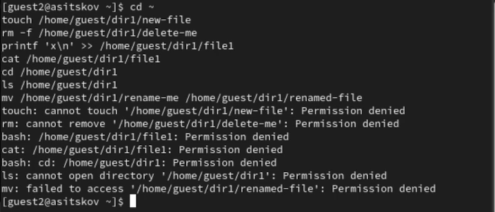
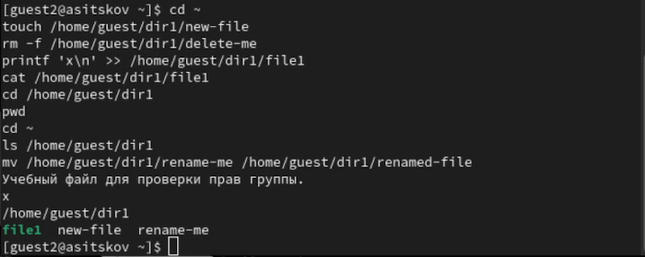
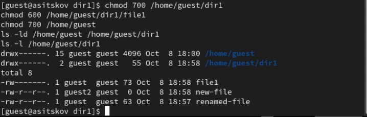

## Докладчик

::: columns
::: {.column width="42%"}
{fig-alt="Портрет Ицкова Андрея Станиславовича" width=72%}
:::
::: {.column width="58%"}
**Ицков Андрей Станиславович**  
Студент группы НФИбд-03-24

Российский университет дружбы народов

Учётная запись виртуальной машины: `asitskov`

В лабораторной работе: `guest` и `guest2`
:::
:::

## Предмет исследования

- **Актуальность:** общая группа позволяет организовать совместную работу с файлами.
- **Объект:** файлы и каталог `/home/guest/dir1` в Linux.
- **Предмет:** доступ участника группы `guest` к объектам владельца `guest`.
- **Практическая значимость:** выбор минимальных прав для совместного доступа.
- Работа воспроизводит известные правила DAC. Научная новизна не заявляется [@rudn_lab3].

## Цель и задачи

- **Цель:** освоить работу с атрибутами файлов для групп пользователей.
- **Гипотеза:** одинаковые тройки битов дают одинаковые обычные операции владельцу и участнику группы.
- Создать `guest2`, включить его в `guest`, проверить идентификаторы.
- Проверить семь операций при `000/000`, `010/000`, `070/070`.
- Определить минимальные права и сравнить результаты с ЛР 2.

## Среда и метод

- Rocky Linux 9.8 в VirtualBox, hostname `asitskov`.
- Два окна терминала с пользователями `guest` и `guest2`.
- `guest` устанавливает режимы. `guest2` выполняет проверки без `sudo`.
- Для чтения и записи используется `file1`, для удаления и переименования отдельные файлы.
- Инструменты: `id`, `groups`, `newgrp`, `chmod`, `touch`, `rm`, `cat`, `cd`, `ls`, `mv`.

## Значение прав группы

- `r=4`, `w=2`, `x=1`. Средняя цифра режима относится к группе.
- `010` даёт группе проход по каталогу, `070` даёт `rwx` [@linux_path].
- Чтение и запись содержимого требуют соответствующих битов файла.
- Создание, удаление и переименование требуют `wx` каталога [@linux_unlink; @linux_rename].
- `chmod` чужого файла требует владения или привилегии [@linux_chmod].

## Общая группа двух пользователей

::: columns
::: {.column width="43%"}

- `guest`: GID `1001`.
- `guest2`: группы `guest` и `guest2`, GID `1001` и `1002`.
- `newgrp guest` активирует общую группу [@linux_newgrp].
- @fig-groups подтверждает результат.

:::
::: {.column width="57%"}

{#fig-groups width=100%}

:::
:::

## Опыт с режимами 000 и 000

::: columns
::: {.column width="38%"}

- У группы нет прав на каталог и `file1`.
- Все семь проверок вернули `Permission denied`.
- @fig-zero показывает команды и результат.

:::
::: {.column width="62%"}

{#fig-zero width=100%}

:::
:::

## Опыт с режимами 010 и 000

::: columns
::: {.column width="38%"}

- Группе разрешён проход по каталогу.
- `pwd` после `cd` показывает `/home/guest/dir1`.
- Остальные шесть операций запрещены (@fig-search).

:::
::: {.column width="62%"}

{#fig-search width=100%}

:::
:::

## Опыт с режимами 070 и 070

::: columns
::: {.column width="38%"}

- Группе доступны `rwx` каталога и файла.
- Все семь операций прошли.
- `cat` выводит содержимое и добавленную строку `x` (@fig-full).

:::
::: {.column width="62%"}

{#fig-full width=100%}

:::
:::

## Результаты таблицы 3.1

Сводка опыта приведена в @tbl-matrix. `+` — успех, `−` — отказ, `НП` — нет отдельной проверки.

| Каталог / файл | Созд. | Удал. | Зап. | Чт. | cd | ls | mv | chmod |
|:--:|:--:|:--:|:--:|:--:|:--:|:--:|:--:|:--:|
| `000/000` | − | − | − | − | − | − | − | НП |
| `010/000` | − | − | − | − | + | − | − | НП |
| `070/070` | + | + | + | + | + | + | + | НП |

: Операции пользователя guest2 {#tbl-matrix}

Для `chmod` ожидается отказ: владелец `file1` — `guest` [@linux_chmod].

## Минимальные права таблицы 3.2

В @tbl-minimum указаны права группы. На предшествующих каталогах пути нужен `x`.

| Операция | Каталог | Файл / подкаталог |
|:--|:--:|:--:|
| Создать / удалить / переименовать файл | `wx` (030) | — |
| Читать файл | `x` (010) | `r` (040) |
| Записать в файл | `x` (010) | `w` (020) |
| Создать подкаталог | `wx` (030) | — |
| Удалить пустой подкаталог | `wx` родителя | — |

: Минимальные права группы {#tbl-minimum}

Операции с подкаталогами следуют из правил `mkdir` и `rmdir` [@linux_mkdir; @linux_rmdir].

## Итоговые файлы и права

::: columns
::: {.column width="43%"}

- `new-file` принадлежит `guest2`, группа `guest`.
- `delete-me` отсутствует, появился `renamed-file`.
- Владелец восстановил `700` у каталогов и `600` у `file1` (@fig-final).

:::
::: {.column width="57%"}

{#fig-final width=100%}

:::
:::

## Сравнение с ЛР 2 и выводы

- Сочетания владельца `000/000`, `100/000`, `700/700` соответствуют групповым `000/000`, `010/000`, `070/070`.
- Для семи проверенных операций результаты совпали.
- Правила чтения, записи и изменения записей каталога сохраняются при смене класса доступа.
- Право менять режим файла связано с владением. Групповые `rwx` его не предоставляют.
- Общая группа и минимальные права позволяют управлять совместным доступом к файлам.

## Источники {.allowframebreaks .scrollable}

::: {#refs}
:::
