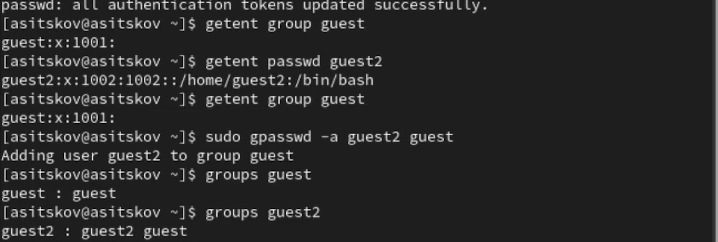
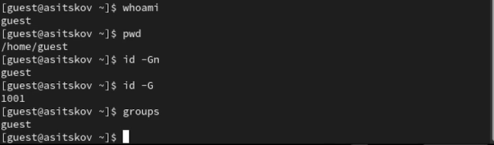
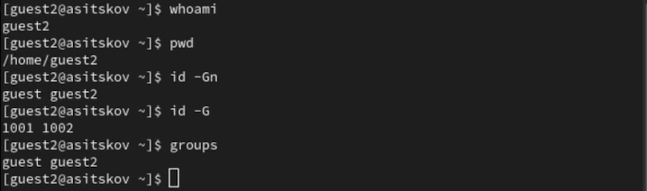
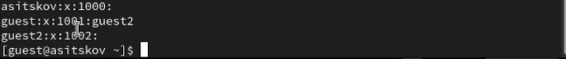
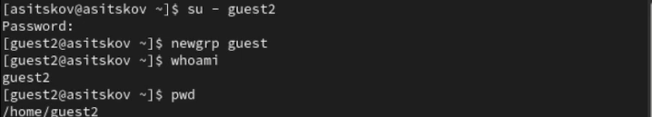
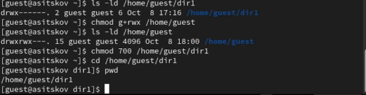
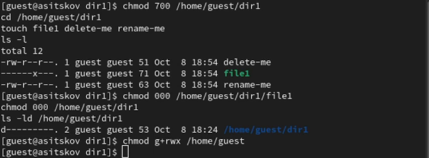
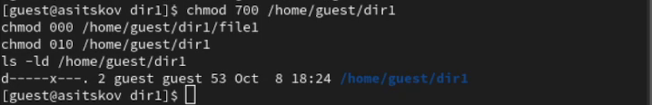
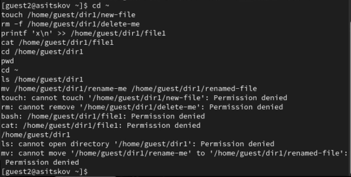
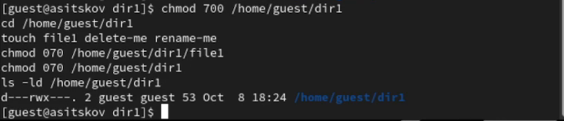

\newpage

```{=openxml}
<w:p><w:r><w:br w:type="page"/></w:r></w:p>
```

# Введение {.unnumbered}

## Цель работы {.unnumbered}

Получить практические навыки работы в консоли с атрибутами файлов для групп пользователей. Исследовать доступ второго пользователя к объектам первого пользователя при разных правах группы.

## Задание {.unnumbered}

Создать пользователя `guest2`, добавить его в группу `guest`, сопоставить идентификаторы и группы двух пользователей, активировать группу командой `newgrp guest`. От имени владельца `guest` изменять права каталога `/home/guest/dir1` и файла `file1`, а от имени `guest2` проверять доступ. Заполнить таблицы 3.1 и 3.2 и сравнить результаты с лабораторной работой № 2 [@rudn_lab3].

Работа выполнена в виртуальной машине Rocky Linux 9.8. Пользователь `guest` и каталог `dir1` подготовлены в предыдущей лабораторной работе. Три сочетания режимов из методических указаний составляют основной опыт: `000/000`, `010/000`, `070/070`. Для этих сочетаний записаны проверки семи операций.

# Теоретическое введение

Права Linux задаются для владельца (`u`), группы (`g`) и остальных пользователей (`o`). Значения битов: `r=4`, `w=2`, `x=1`. В режиме `070` средняя цифра задаёт `rwx` группе, а у владельца и остальных эти биты отсутствуют. Для `guest2`, который не владеет `file1`, но входит в его группу `guest`, применяются права группы. Владелец `guest` проверяется по битам владельца [@linux_path].

У файла `r` разрешает чтение содержимого, `w` — запись, `x` — выполнение. У каталога `x` разрешает проход и поиск известного имени, `r` — получение списка имён, `w` — изменение записей. Поэтому право чтения файла нужно рассматривать вместе с проходом по родительским каталогам [@linux_path].

Удаление и переименование меняют записи содержащего каталога. Для них требуются `w+x` на каталоге, а права содержимого самого файла не определяют возможность этих операций [@linux_unlink; @linux_rename].

Членство в группе не даёт право менять режим чужого файла. Для `chmod` требуется владеть файлом либо иметь привилегию `CAP_FOWNER`. В опытах режимы устанавливает владелец `guest` [@linux_chmod].

# Выполнение лабораторной работы

## Создание второго пользователя и включение в группу

От имени администратора проверена существующая запись `guest`, создан пользователь `guest2` и задан его пароль. Затем `guest2` добавлен в группу `guest`:

```bash
getent passwd guest
sudo useradd guest2
sudo passwd guest2
sudo gpasswd -a guest2 guest
getent passwd guest2
groups guest
groups guest2
```

В базе пользователей у `guest` UID/GID `1001`, у `guest2` — `1002`. После добавления команда `groups guest2` показывает группы `guest2 guest`; `groups guest` показывает `guest`. Успешное добавление и записи пользователей видны на @fig-users.

{#fig-users width=95%}

## Вход и сравнение идентификаторов

В двух отдельных окнах терминала выполнен вход под двумя пользователями:

```bash
su - guest
```

```bash
su - guest2
```

В каждом окне проверены текущий пользователь, домашний каталог и группы:

```bash
whoami
pwd
id -Gn
id -G
groups
```

У `guest` команда `pwd` показывает `/home/guest`, у `guest2` — `/home/guest2`. В приглашениях символ `~` обозначает соответствующий домашний каталог. `id -Gn` выводит имена групп, `id -G` — их числовые идентификаторы; `groups` согласуется с именами из `id -Gn`. Для `guest` получена группа `guest` и GID `1001` (@fig-guest). Для `guest2` после активации общей группы получены `guest guest2` и `1001 1002` (@fig-guest2).

{#fig-guest width=95%}

{#fig-guest2 width=95%}

## База групп и активация общей группы

Сведения сопоставлены с файлом групп:

```bash
cat /etc/group
```

Строка `guest:x:1001:guest2` подтверждает, что `guest2` указан среди дополнительных участников группы `guest`. Строка `guest2:x:1002:` описывает его собственную группу (@fig-groupdb). Основная группа пользователя также определяется записью в базе пользователей и не обязана повторяться в списке участников `/etc/group`.

{#fig-groupdb width=95%}

В терминале `guest2` выполнена команда:

```bash
newgrp guest
```

Команда запускает оболочку с текущей группой `guest`. Имя пользователя остаётся `guest2`, домашний каталог остаётся `/home/guest2` (@fig-newgrp). Результаты `id -Gn` и `id -G` на @fig-guest2 подтверждают группу `guest` с GID `1001` [@linux_newgrp].

{#fig-newgrp width=95%}

## Подготовка каталога и файлов

В терминале владельца `guest` открыт доступ группе к домашнему каталогу. Это позволяет `guest2` проходить к вложенному `dir1`:

```bash
chmod g+rwx /home/guest
ls -ld /home/guest
chmod 700 /home/guest/dir1
cd /home/guest/dir1
pwd
```

Получен режим `/home/guest` `770` (`drwxrwx---`), а команда `pwd` подтверждает путь `/home/guest/dir1` (@fig-home).

{#fig-home width=95%}

Для опытов использованы три отдельных объекта: `file1` для чтения и записи, `delete-me` для удаления, `rename-me` для переименования. Их наличие проверено командой `ls -l`:

```bash
touch file1 delete-me rename-me
ls -l
```

Файлы принадлежат `guest` и группе `guest`. Команда `touch` существующие файлы не очищает. На @fig-mode000 показаны подготовленные файлы и установка первого сочетания режимов.

## Сочетание 000 для каталога и 000 для файла

Владелец сначала изменил режим файла, затем режим каталога:

```bash
chmod 000 /home/guest/dir1/file1
chmod 000 /home/guest/dir1
ls -ld /home/guest/dir1
```

Режим каталога стал `d---------` (@fig-mode000).

{#fig-mode000 width=95%}

От имени `guest2` выполнены проверки:

```bash
cd ~
touch /home/guest/dir1/new-file
rm -f /home/guest/dir1/delete-me
printf 'x\n' >> /home/guest/dir1/file1
cat /home/guest/dir1/file1
cd /home/guest/dir1
ls /home/guest/dir1
mv /home/guest/dir1/rename-me /home/guest/dir1/renamed-file
```

Все семь операций завершились отказом `Permission denied` (@fig-test000). При отсутствии `x` у каталога недоступны пути к вложенным объектам. Без `r` нельзя получить список имён.

{#fig-test000 width=95%}

## Сочетание 010 для каталога и 000 для файла

Перед настройкой следующего опыта владелец восстановил свой проход в каталог:

```bash
chmod 700 /home/guest/dir1
chmod 000 /home/guest/dir1/file1
chmod 010 /home/guest/dir1
ls -ld /home/guest/dir1
```

Каталог получил `d-----x---`: группе разрешён только проход (@fig-mode010).

{#fig-mode010 width=95%}

В терминале `guest2` повторены проверки. После входа путь проверен командой `pwd`, затем выполнен возврат домой перед оставшимися операциями:

```bash
cd ~
touch /home/guest/dir1/new-file
rm -f /home/guest/dir1/delete-me
printf 'x\n' >> /home/guest/dir1/file1
cat /home/guest/dir1/file1
cd /home/guest/dir1
pwd
cd ~
ls /home/guest/dir1
mv /home/guest/dir1/rename-me /home/guest/dir1/renamed-file
```

Вход успешен: `pwd` вывел `/home/guest/dir1`. Остальные шесть операций запрещены (@fig-test010). Бит `x` сам по себе разрешает перейти в каталог, но не даёт читать список имён или изменять записи. Для `file1` отсутствуют биты чтения и записи группы.

{#fig-test010 width=95%}

## Сочетание 070 для каталога и 070 для файла

От имени `guest` установлено третье сочетание:

```bash
chmod 700 /home/guest/dir1
cd /home/guest/dir1
touch file1 delete-me rename-me
chmod 070 /home/guest/dir1/file1
chmod 070 /home/guest/dir1
ls -ld /home/guest/dir1
```

Режим каталога `d---rwx---` подтверждает полный набор прав группы (@fig-mode070).

{#fig-mode070 width=95%}

Пользователь `guest2` повторил тот же блок проверок с `pwd` и возвратом через `cd ~`. Все семь операций прошли (@fig-test070): создан `new-file`, удалён `delete-me`, в `file1` добавлена строка `x`, содержимое прочитано, вход выполнен, список имён получен, `rename-me` переименован в `renamed-file`.

{#fig-test070 width=95%}

Вывод `ls` в блоке расположен до `mv`, поэтому в нём ещё видно прежнее имя `rename-me`. Окончательное имя и отсутствие удалённого файла подтверждены последующей проверкой владельца на @fig-restore.

\clearpage

## Проверка итоговых файлов и восстановление прав

По завершении опытов `guest` закрыл доступ группе к домашнему каталогу и вернул обычные права на свои объекты:

```bash
chmod 700 /home/guest/dir1
chmod 600 /home/guest/dir1/file1
chmod 700 /home/guest
ls -ld /home/guest /home/guest/dir1
ls -l /home/guest/dir1
```

Оба каталога имеют режим `700`, `file1` — `600`. В списке остались `file1`, `new-file` и `renamed-file`; `delete-me` отсутствует. Владелец `new-file` — `guest2`, группа — `guest` (@fig-restore). Это подтверждает создание файла с текущей группой оболочки и окончательные результаты удаления и переименования.

{#fig-restore width=95%}

# Анализ результатов

## Установленные права и действия группы

В @tbl-matrix приведены результаты для `guest2`. Обозначения: «Созд.» — создание файла, «Удал.» — удаление, «Зап.» — запись, «Чт.» — чтение, `cd` — вход, `ls` — список имён, `mv` — переименование. Знак `+` означает успешную операцию, `−` — отказ. `НП` означает, что отдельная проверка в записи отсутствует.

| Каталог | file1 | Созд. | Удал. | Зап. | Чт. | cd | ls | mv | chmod |
|:---:|:---:|:---:|:---:|:---:|:---:|:---:|:---:|:---:|:---:|
| 000 | 000 | − | − | − | − | − | − | − | НП |
| 010 | 000 | − | − | − | − | + | − | − | НП |
| 070 | 070 | + | + | + | + | + | + | + | НП |

: Установленные режимы и результаты операций пользователя guest2 {#tbl-matrix}

Смена режима файла `file1` от имени `guest2` отдельно не выполнялась. По правилу `chmod` ожидается отказ во всех трёх строках: `guest2` не является владельцем `file1` и не использует привилегии. Для `010/000` и `070/070` наличие прохода не заменяет требование владения [@linux_chmod].

\clearpage

## Минимальные права группы

На основании опыта и правил файловой системы получены минимальные права в @tbl-minimum. В таблице указаны именно права группы. Знак «—» означает, что биты существующего файла или удаляемого пустого подкаталога для этой операции не требуются. На всех предшествующих компонентах пути необходим проход. Создание и удаление подкаталога приведены как вывод из правил `mkdir` и `rmdir`, а не как отдельные записанные проверки [@linux_mkdir; @linux_rmdir].

\begingroup
\small

| Операция | На каталог | На файл / подкаталог |
|:--|:--:|:--:|
| Создание файла | `wx` (030) | — |
| Удаление файла | `wx` (030) | — |
| Чтение файла | `x` (010) | `r` (040) |
| Запись в файл | `x` (010) | `w` (020) |
| Переименование файла внутри каталога | `wx` (030) | — |
| Создание подкаталога | `wx` (030) | — |
| Удаление пустого подкаталога | `wx` (030) у родителя | — |

: Минимальные права группы для операций с файлами и каталогами {#tbl-minimum}

\endgroup

Эти условия относятся к обычным объектам без дополнительных запретов. Sticky bit, ACL, immutable и другие ограничения отдельно в этой работе не исследовались. Для непустого подкаталога удаление требует предварительного удаления его содержимого.

\clearpage

## Сравнение с лабораторной работой 2

В лабораторной работе № 2 операции выполнял владелец `guest`; в данной работе их выполняет `guest2`, участник группы `guest`. Для сопоставления берутся одинаковые тройки битов: режим владельца `100` соответствует групповому `010`, а `700` — групповому `070`.

Для семи проверенных операций совпадают результаты трёх соответствующих сочетаний: `000/000`, `100/000` и `700/700` из таблицы 2.1 дают те же разрешения, что `000/000`, `010/000` и `070/070` из таблицы 3.1. Значение битов каталога и файла сохраняется при смене класса доступа.

Различается право `chmod`: в ЛР 2 `guest` владеет файлом и при доступном пути может менять его режим. Пользователь `guest2` получает доступ через группу, но право владения остаётся у `guest`. Этот вывод следует из правила `chmod` и не подменяет отсутствующую отдельную проверку [@linux_chmod].

# Выводы

Создана учётная запись `guest2`, подтверждено её членство в группе `guest`, сопоставлены имена и числовые идентификаторы групп. Команда `newgrp guest` активировала общую группу в оболочке второго пользователя.

Проверены семь операций для трёх сочетаний прав. При `000/000` все они запрещены; при `010/000` разрешён только вход в каталог; при `070/070` все семь проходят. Результаты согласуются с соответствующими сочетаниями прав владельца в ЛР 2. Для чтения и записи важны права файла и проход к нему, а для создания, удаления и переименования — права на каталог.

Таблицы 3.1 и 3.2 показывают правила доступа участника группы и минимальные наборы битов для типовых действий. Смена режима чужого файла требует владения или привилегии и не разрешается только за счёт групповых `rwx`.

# Список литературы {.unnumbered}

\begingroup
\small

::: {#refs}
:::

\endgroup
