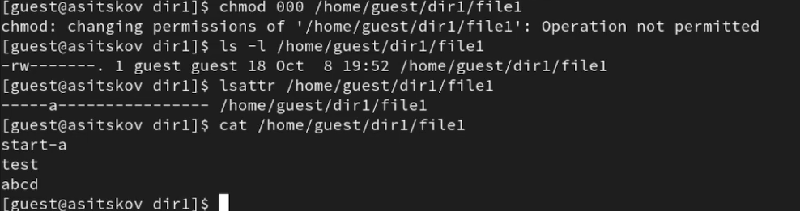
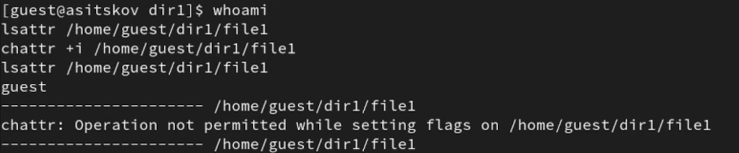
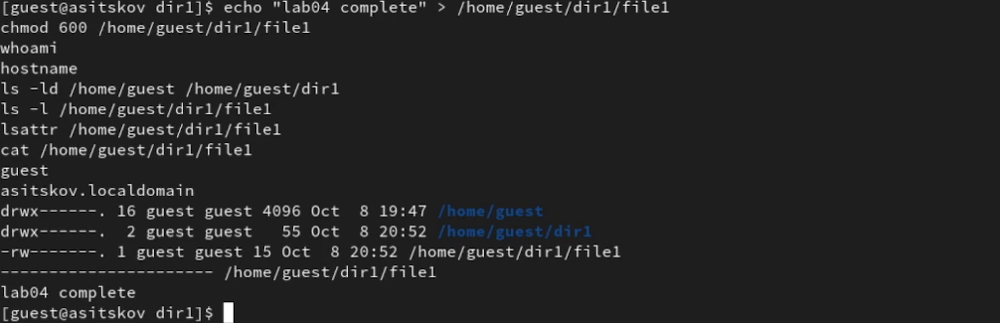

## Докладчик

::: columns
::: {.column width="42%"}
{fig-alt="Портрет Ицкова Андрея Станиславовича" width=72%}
:::
::: {.column width="58%"}
**Ицков Андрей Станиславович**  
Студент группы НФИбд-03-24

Российский университет дружбы народов

Учётная запись виртуальной машины: `asitskov`

В опыте: владелец `guest`, администратор `root`
:::
:::

## Предмет исследования

- **Актуальность:** права 600 сами по себе разрешают владельцу менять содержимое.
- **Объект:** файл `/home/guest/dir1/file1` в Linux.
- **Предмет:** ограничения расширенных атрибутов `a` и `i`.
- **Практическая значимость:** защита накопленных записей и неизменяемых файлов.
- Исследуются известные механизмы Linux; научная новизна не заявляется [@rudn_lab4].

## Цель и задачи

- **Цель:** освоить работу с расширенными атрибутами файлов.
- **Гипотеза:** расширенные атрибуты могут запрещать операции, разрешённые обычными правами.
- Проверить установку флагов владельцем и администратором.
- Проверить чтение, запись, удаление, переименование и `chmod`.
- Снять ограничение и сопоставить результаты.

## Среда и метод

- Rocky Linux 9.8 в VirtualBox, файловая система XFS.
- Файл принадлежит `guest:guest`, режим 600; каталог — 700.
- `root` устанавливает и снимает флаги; `guest` выполняет операции.
- Опыт с `a` и проверки привилегий — по видеозаписи.
- Поведение установленного `i` — по документации [@linux_chattr; @linux_chmod].

## Что означают a и i

| Свойство | a | i |
|:--|:--|:--|
| Назначение | Только дозапись | Неизменяемость |
| Чтение при 600 | Разрешено | Разрешено |
| Дозапись `>>` | Разрешена | Запрещена |
| Перезапись `>` | Запрещена | Запрещена |

`lsattr` показывает флаги, `chattr` изменяет их. Для установки и снятия `a` и `i` требуется привилегия [@linux_chattr; @linux_lsattr].

## Установка a: владелец и root

::: columns
::: {.column width="40%"}

- У `guest` установка возвращает отказ.
- `root` выполняет `chattr +a` успешно.
- `lsattr` подтверждает букву `a` (@fig-set).

:::
::: {.column width="60%"}

{#fig-set width=100%}

:::
:::

## Дозапись и чтение разрешены

::: columns
::: {.column width="38%"}

- Файл имеет режим 600 и флаг `a`.
- `echo "test" >> file1` добавляет строку.
- `cat` выводит `start-a` и `test` (@fig-append-slide).

:::
::: {.column width="62%"}

{#fig-append-slide width=100%}

:::
:::

## Перезапись и удаление запрещены

::: columns
::: {.column width="38%"}

- `>` требует замены содержимого.
- Перезапись и `rm` возвращают `Operation not permitted`.
- Файл сохраняется (@fig-delete-slide).

:::
::: {.column width="62%"}

{#fig-delete-slide width=100%}

:::
:::

## Права сохраняются при a

::: columns
::: {.column width="38%"}

- Переименование запрещено.
- `chmod 000` также запрещён.
- Права остаются 600, флаг `a` сохраняется.
- Чтение доступно (@fig-chmod-slide).

:::
::: {.column width="62%"}

{#fig-chmod-slide width=100%}

:::
:::

## После снятия a

::: columns
::: {.column width="40%"}

- `root` выполняет `chattr -a`.
- Перезапись, переименование и удаление снова доступны.
- `chmod 000` проходит; чтение при 000 запрещено.
- Режим возвращён к 600.

:::
::: {.column width="60%"}

{#fig-unset-slide width=100%}

:::
:::

## Атрибут i и привилегии

::: columns
::: {.column width="40%"}

- Попытка `guest` установить `i` запрещена (@fig-i-slide).
- По документации `i` запрещает также дозапись.
- Чтение при 600 разрешено.
- Ограничения установленного `i` рассмотрены теоретически [@linux_chattr].

:::
::: {.column width="60%"}

{#fig-i-slide width=100%}

:::
:::

## Сопоставление операций

| Операция | Без флагов: опыт | a: опыт | i: документация |
|:--|:--:|:--:|:--:|
| Чтение при 600 | Да | Да | Да |
| Дозапись | Да | Да | Нет |
| Перезапись | Да | Нет | Нет |
| Удаление | Да | Нет | Нет |
| Переименование | Да | Нет | Нет |
| Изменение режима | Да | Нет | Нет |

Свойства `i` приведены по документации [@linux_chattr; @linux_chmod].

## Итоговое состояние

::: columns
::: {.column width="38%"}

- Каталоги — 700.
- Файл — `guest:guest`, 600.
- `a` и `i` отсутствуют.
- Содержимое: `lab04 complete` (@fig-final-slide).

:::
::: {.column width="62%"}

{#fig-final-slide width=100%}

:::
:::

## Выводы

- Гипотеза подтверждена опытом с `a`: обычного права записи недостаточно для перезаписи.
- `a` позволяет дополнять файл, защищая прежние данные и имя файла.
- Обычный владелец не может установить `a` и `i`.
- `i` по документации запрещает все изменения, включая дозапись.
- Освоены `lsattr`, `chattr` и проверка их взаимодействия с `chmod`.

## Список литературы {.allowframebreaks .scrollable}

::: {#refs}
:::
