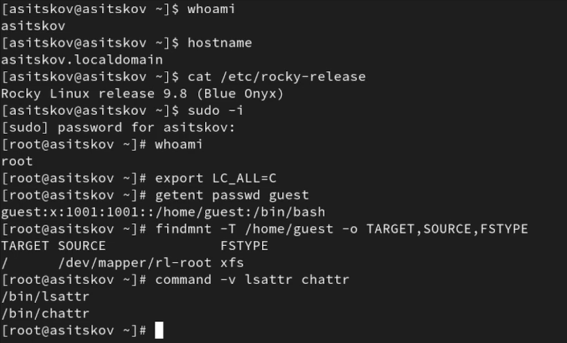
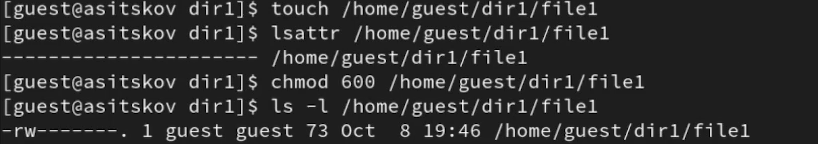
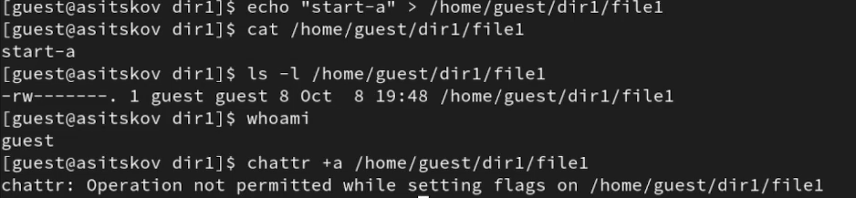
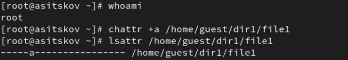
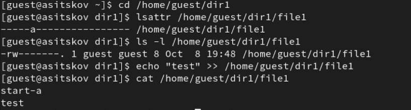
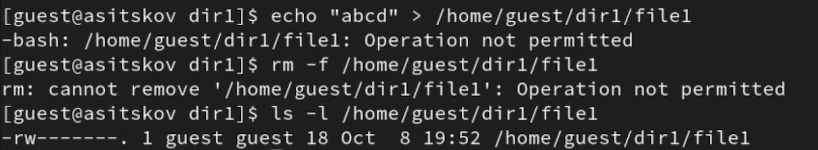
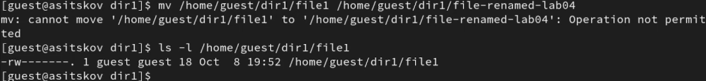
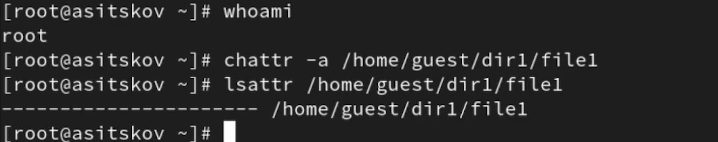
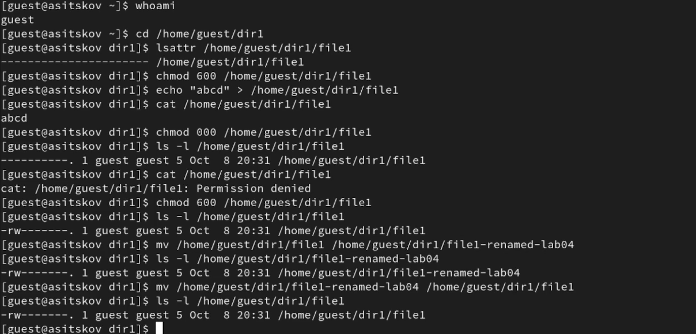

\newpage

```{=openxml}
<w:p><w:r><w:br w:type="page"/></w:r></w:p>
```

# Введение {.unnumbered}

## Цель работы {.unnumbered}

Получить практические навыки работы с расширенными атрибутами файлов Linux. Исследовать ограничения атрибутов `a` (только дозапись) и `i` (неизменяемость) и их связь с обычными правами доступа [@rudn_lab4].

## Задание {.unnumbered}

Проверить исходные атрибуты файла `/home/guest/dir1/file1`, установить права 600, исследовать возможность установки флага обычным пользователем и администратором. Проверить чтение, дозапись, перезапись, удаление, переименование и изменение режима. Снять ограничение и повторить операции. Сопоставить свойства `a` и `i` [@rudn_lab4].

В работе используются Rocky Linux 9.8, файловая система XFS, учётные записи `guest` и `root`. Экспериментальные результаты приведены по записи выполнения от 8 октября 2026 года. Свойства `i`, не подтверждённые экспериментом, в сравнении явно обозначены как результаты анализа документации.

# Теоретическое введение

Обычные права файла распределяются между владельцем, группой и остальными пользователями. Режим 600 разрешает владельцу читать и изменять содержимое, остальные пользователи этих прав не имеют. Удаление и переименование связаны с правами на родительский каталог; в опыте владелец имеет права 700 на каталог.

Расширенные атрибуты добавляют ограничения. Команда `lsattr` показывает текущие флаги; `chattr +a` добавляет `a`, а `chattr -a` снимает его. Аналогичный синтаксис применяется к `i` [@linux_lsattr; @linux_chattr].

- `a` допускает запись только в конец файла. Перенаправление `>>` сохраняет прежнее содержимое и добавляет новые данные. Перенаправление `>` пытается обнулить файл и при `a` запрещено.
- `i` запрещает изменение содержимого, удаление и переименование; чтение при достаточных обычных правах допускается.
- Установка и снятие `a` и `i` требуют привилегии `CAP_LINUX_IMMUTABLE`. Самого владения файлом недостаточно [@linux_chattr].
- Изменение режима `chmod` для файла с `a` или `i` запрещено. После снятия флага владелец снова может менять обычные права [@linux_chmod].

# Выполнение лабораторной работы

## Подготовка среды и исходного файла

Проверены пользователь, имя машины, версия ОС, файловая система и наличие утилит:

```bash
whoami
hostname
cat /etc/rocky-release
sudo -i
whoami
getent passwd guest
findmnt -T /home/guest -o TARGET,SOURCE,FSTYPE
command -v lsattr chattr
```

ОС — Rocky Linux 9.8; имя машины — `asitskov.localdomain`. Учётная запись `guest` имеет UID и GID 1001. Домашний каталог размещён на XFS; утилиты доступны в `/bin` (@fig-environment).

{#fig-environment width=100%}

От имени `guest` проверены исходные флаги и установлен режим 600:

```bash
touch /home/guest/dir1/file1
lsattr /home/guest/dir1/file1
chmod 600 /home/guest/dir1/file1
ls -l /home/guest/dir1/file1
```

Флаги `a` и `i` отсутствуют. Владелец и группа файла — `guest`, обычные права — `-rw-------` (@fig-initial).

{#fig-initial width=100%}

## Установка атрибута a

Подготовлено содержимое `start-a`. Попытка установить `a` выполнена владельцем `guest`:

```bash
echo "start-a" > /home/guest/dir1/file1
cat /home/guest/dir1/file1
whoami
chattr +a /home/guest/dir1/file1
```

Операция возвращает `Operation not permitted` (@fig-guest-a). Это ожидаемый отказ: обычный владелец не обладает требуемой привилегией.

{#fig-guest-a width=100%}

От имени `root` атрибут установлен успешно:

```bash
whoami
chattr +a /home/guest/dir1/file1
lsattr /home/guest/dir1/file1
```

В выводе `lsattr` появляется `a` (@fig-root-a). Последующие проверки выполняются от имени `guest`.

{#fig-root-a width=100%}

## Дозапись и чтение при a

```bash
lsattr /home/guest/dir1/file1
ls -l /home/guest/dir1/file1
echo "test" >> /home/guest/dir1/file1
cat /home/guest/dir1/file1
```

Дозапись разрешена: к исходной строке `start-a` добавляется `test`. Чтение доступно, режим файла остаётся 600 (@fig-append). В продолжении опыта аналогично добавлена строка `abcd`.

{#fig-append width=100%}

## Перезапись и удаление при a

```bash
echo "abcd" > /home/guest/dir1/file1
rm -f /home/guest/dir1/file1
ls -l /home/guest/dir1/file1
```

Перезапись и удаление возвращают `Operation not permitted`. Файл продолжает существовать и имеет прежние права (@fig-write-delete). Успешная дозапись не означает возможности заменить всё содержимое.

{#fig-write-delete width=100%}

## Переименование при a

```bash
mv /home/guest/dir1/file1 /home/guest/dir1/file1-renamed-lab04
ls -l /home/guest/dir1/file1
```

Переименование запрещено с сообщением `Operation not permitted`; исходное имя сохраняется (@fig-rename).

{#fig-rename width=100%}

## Изменение обычных прав при a

```bash
chmod 000 /home/guest/dir1/file1
ls -l /home/guest/dir1/file1
lsattr /home/guest/dir1/file1
cat /home/guest/dir1/file1
```

Команда `chmod 000` завершается отказом. Режим 600 и флаг `a` сохраняются; чтение выводит `start-a`, `test`, `abcd` (@fig-chmod). Ограничение распространяется на изменение режима, а не только на содержимое.

{#fig-chmod width=100%}

## Снятие a и повтор операций

Администратор снимает флаг:

```bash
chattr -a /home/guest/dir1/file1
lsattr /home/guest/dir1/file1
```

Буква `a` отсутствует в выводе (@fig-remove-a).

{#fig-remove-a width=100%}

Владелец повторяет перезапись и изменение режима:

```bash
chmod 600 /home/guest/dir1/file1
echo "abcd" > /home/guest/dir1/file1
cat /home/guest/dir1/file1
chmod 000 /home/guest/dir1/file1
ls -l /home/guest/dir1/file1
cat /home/guest/dir1/file1
chmod 600 /home/guest/dir1/file1
```

Перезапись проходит: остаётся одна строка `abcd`. Режим 000 устанавливается успешно и запрещает чтение; после восстановления 600 доступ возвращается. Переименование в `file1-renamed-lab04` и обратное переименование также выполняются (@fig-without-a).

{#fig-without-a width=100%}

Удаление файла без ограничивающих атрибутов выполнено успешно; перед дальнейшими проверками файл создан заново. При отсутствии `a` и `i` ограничения определяются обычными правами доступа.

## Проверка привилегий для i

Подготовлен файл с содержимым `start-i`, режимом 600 и владельцем `guest`. Выполнена проверка установки атрибута от имени владельца:

```bash
whoami
lsattr /home/guest/dir1/file1
chattr +i /home/guest/dir1/file1
lsattr /home/guest/dir1/file1
```

Как и для `a`, установка `i` обычным пользователем запрещена. В выводе остаются прежние флаги (@fig-guest-i).

{#fig-guest-i width=100%}

Экспериментально подтверждён запрет установки `i` непривилегированным владельцем. Ограничения операций при установленном `i` рассмотрены по документации `chattr` и `chmod` в следующем разделе [@linux_chattr; @linux_chmod].

## Итоговое состояние

```bash
whoami
hostname
ls -ld /home/guest /home/guest/dir1
ls -l /home/guest/dir1/file1
lsattr /home/guest/dir1/file1
cat /home/guest/dir1/file1
```

В конце работы каталоги имеют права 700. Файл принадлежит `guest:guest`, имеет права 600, не содержит `a` и `i`; его содержимое — `lab04 complete` (@fig-final).

{#fig-final width=100%}

# Анализ результатов

@tbl-comparison сопоставляет операции владельца при обычных правах 600 и каталоге 700. В столбцах «без флагов» и «a» указаны наблюдения по записи; столбец «i» содержит свойства из документации [@linux_chattr; @linux_chmod]. Значения для `i` не представлены как выполненный эксперимент.

| Операция от guest | Без a/i (опыт) | a (опыт) | i (документация) |
|:--|:--:|:--:|:--:|
| Чтение при 600 | Разрешено | Разрешено | Разрешено |
| Дозапись через `>>` | Разрешена | Разрешена | Запрещена |
| Перезапись через `>` | Разрешена | Запрещена | Запрещена |
| Удаление | Разрешено | Запрещено | Запрещено |
| Переименование | Разрешено | Запрещено | Запрещено |
| Изменение режима `chmod` | Разрешено | Запрещено | Запрещено |

: Сопоставление обычного режима и расширенных атрибутов {#tbl-comparison}

Основное различие — возможность дозаписи. `a` подходит для данных, которые должны накапливаться без удаления прежних записей. `i` защищает файл от любых изменений до снятия флага привилегированным пользователем. Оба атрибута дополняют обычные права; они не предоставляют права чтения пользователю, у которого этих прав нет.

В опыте запрет `chmod 000` при `a` сохранил возможность чтения файла. После снятия `a` тот же владелец установил 000, и `cat` вернул `Permission denied`. Это показывает разницу между запретом изменения атрибутов и отсутствием обычного права чтения.

# Выводы

Освоены команды `lsattr` и `chattr`, проверены установка и снятие `a` администратором. Эксперимент подтвердил, что `a` разрешает дозапись и чтение, запрещая перезапись, удаление, переименование и изменение режима. После снятия флага обычные операции владельца снова доступны.

Проверено, что владелец `guest` не может самостоятельно установить ни `a`, ни `i`. По документации изучено отличие `i`: неизменяемость запрещает также дозапись. Результаты для установленного `i` имеют теоретическое основание; экспериментальная часть охватывает `a`, обычные права и проверку привилегий установки обоих флагов.

# Список литературы {.unnumbered}

::: {#refs}
:::
