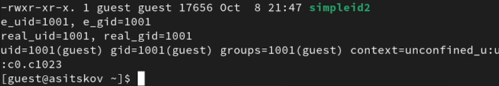
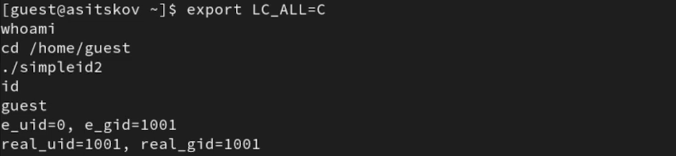
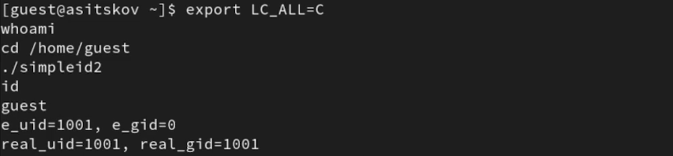
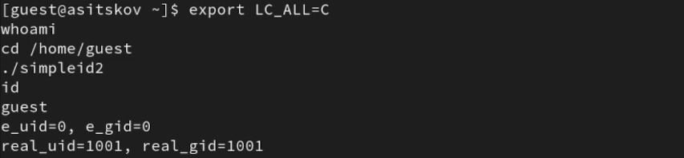
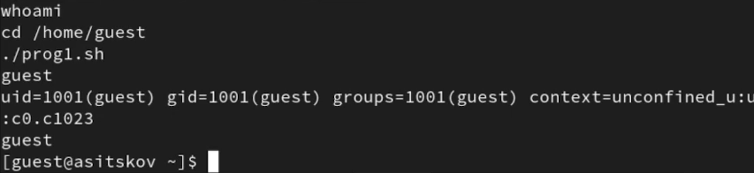
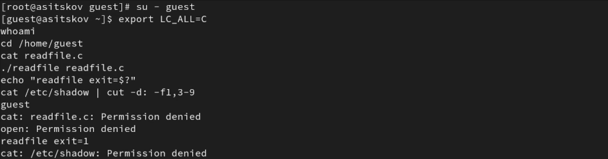
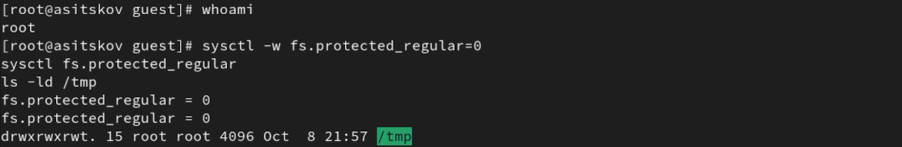
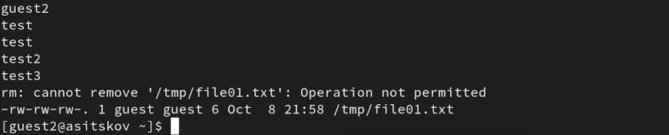
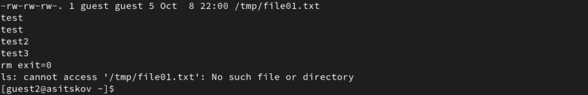

## Докладчик

::: columns
::: {.column width="42%"}
{fig-alt="Портрет Ицкова Андрея Станиславовича" width=72%}
:::
::: {.column width="58%"}
**Ицков Андрей Станиславович**  
Студент группы НФИбд-03-24

Российский университет дружбы народов

Учётная запись ВМ: `asitskov`

В опыте: `guest`, `guest2`, `root`
:::
:::

## Предмет исследования

- **Актуальность:** права процесса могут отличаться от прав пользователя, запустившего программу.
- **Объект:** процессы и файлы Linux.
- **Предмет:** SetUID, SetGID и sticky bit.
- **Практическая значимость:** контроль привилегированных программ и защита общих каталогов.
- Исследуются известные механизмы; научная новизна не заявляется [@rudn_lab5].

## Цель и задачи

- **Цель:** исследовать дополнительные биты прав и идентификаторы процессов.
- **Гипотеза:** SetUID/SetGID изменяют эффективные ID; sticky bit ограничивает удаление чужих файлов.
- Сравнить реальные и эффективные UID/GID.
- Проверить доступ к закрытым файлам через программу SetUID.
- Сопоставить операции в `/tmp` с t и без t.

## Среда и метод

- Rocky Linux 9.8 в VirtualBox, файловая система XFS, GCC 11.5.0.
- `guest`: UID/GID 1001; `guest2`: UID/GID 1002 и группа guest.
- Запуск программ от guest; настройка прав от root.
- В опыте SELinux Permissive; для сравнения sticky bit — protected_regular=0.
- После опытов восстановлены исходные настройки.

## Реальные и эффективные ID

- `getuid()` / `getgid()` — реальные UID/GID.
- `geteuid()` / `getegid()` — эффективные UID/GID.
- SetUID (4000) использует владельца программы.
- SetGID (2000) использует группу программы.
- Реальные ID сохраняются [@linux_credentials; @linux_execve].

## Обычный запуск программы

::: columns
::: {.column width="40%"}

- simpleid2 запущена от guest.
- Реальные и эффективные ID совпадают: 1001.
- Исполняемый файл имеет режим 755 (@fig-base-slide).

:::
::: {.column width="60%"}

{#fig-base-slide width=100%}

:::
:::

## SetUID: эффективный UID владельца

::: columns
::: {.column width="40%"}

- Владелец root, группа guest.
- Режим 4755.
- Эффективный UID = 0.
- Реальный UID = 1001 (@fig-suid-slide).

:::
::: {.column width="60%"}

{#fig-suid-slide width=100%}

:::
:::

## SetGID: эффективный GID группы

::: columns
::: {.column width="40%"}

- Владелец и группа root.
- Режим 2755.
- Эффективный GID = 0.
- UID остаётся 1001 (@fig-sgid-slide).

:::
::: {.column width="60%"}

{#fig-sgid-slide width=100%}

:::
:::

## Оба бита: эффективные ID равны 0

::: columns
::: {.column width="40%"}

- Владелец и группа root.
- Режим 6755.
- Эффективные UID/GID = 0.
- Реальные UID/GID = 1001 (@fig-both-slide).

:::
::: {.column width="60%"}

{#fig-both-slide width=100%}

:::
:::

## Сравнение идентификаторов

| Режим программы | Реальный UID | Эфф. UID | Реальный GID | Эфф. GID |
|:--|--:|--:|--:|--:|
| 755 | 1001 | 1001 | 1001 | 1001 |
| 4755 | 1001 | 0 | 1001 | 1001 |
| 2755 | 1001 | 1001 | 1001 | 0 |
| 6755 | 1001 | 0 | 1001 | 0 |

: Результаты simpleid2 от guest {#tbl-ids-slide}

В @tbl-ids-slide меняются эффективные ID. Обычная оболочка и команда `id` сохраняют пользователя guest.

## SetUID на сценарии оболочки

::: columns
::: {.column width="40%"}

- prog1.sh содержит `id` и `whoami`.
- Владелец root, режим 4755.
- Вывод сохраняет UID/GID 1001 и имя guest (@fig-script-slide).
- Linux игнорирует эти биты для сценариев [@linux_execve].

:::
::: {.column width="60%"}

{#fig-script-slide width=100%}

:::
:::

## Закрытый файл: обычного доступа нет

::: columns
::: {.column width="40%"}

- readfile читает блоками по 16 байт.
- readfile.c: root:root, режим 600.
- От guest: `Permission denied`.
- Код завершения readfile — 1 (@fig-denied-slide).

:::
::: {.column width="60%"}

{#fig-denied-slide width=100%}

:::
:::

## SetUID открывает доступ к исходнику

::: columns
::: {.column width="40%"}

- readfile: root:guest, режим 4755.
- Исходник остаётся закрытым для guest.
- Программа выводит его текст.
- Код завершения — 0 (@fig-read-slide).

:::
::: {.column width="60%"}

{#fig-read-slide width=100%}

:::
:::

## Проверка на /etc/shadow

::: columns
::: {.column width="40%"}

- readfile читает системный файл.
- Второе поле исключено из изображения.
- Код readfile — 0.
- Обычная команда `id` показывает guest (@fig-shadow-slide).

:::
::: {.column width="60%"}

{#fig-shadow-slide width=100%}

:::
:::

## Подготовка сравнения sticky bit

::: columns
::: {.column width="40%"}

- `/tmp`: root:root, режим 1777.
- Файл guest:guest имеет права 666.
- От root установлено protected_regular=0 (@fig-control-slide) [@linux_sysctl].
- Между сериями меняется бит t.

:::
::: {.column width="60%"}

{#fig-control-slide width=100%}

:::
:::

## С sticky bit: запись есть, удаления нет

::: columns
::: {.column width="40%"}

- guest2 читает файл guest.
- Дозапись добавляет test2.
- Перезапись оставляет test3.
- Удаление запрещено; файл сохраняется (@fig-sticky-slide).

:::
::: {.column width="60%"}

{#fig-sticky-slide width=100%}

:::
:::

## Без sticky bit: удаление разрешено

::: columns
::: {.column width="40%"}

- После `chmod -t /tmp` режим — 777.
- Чтение и запись по-прежнему доступны.
- `rm exit=0`.
- Файл больше не найден (@fig-delete-slide).

:::
::: {.column width="60%"}

{#fig-delete-slide width=100%}

:::
:::

## Что защищает sticky bit

| Операция guest2 с файлом guest, 666 | /tmp 1777 | /tmp 777 |
|:--|:--|:--|
| Чтение | Разрешено | Разрешено |
| Дозапись и перезапись | Разрешены | Разрешены |
| Удаление | Запрещено | Разрешено |

: Результаты при protected_regular=0 {#tbl-sticky-slide}

В @tbl-sticky-slide изменился результат удаления. Sticky bit защищает запись каталога; содержимое защищается обычными правами файла [@linux_chmod].

## Завершение и восстановление

::: columns
::: {.column width="40%"}

- `/tmp` снова имеет режим 1777.
- protected_regular=1.
- SELinux Enforcing.
- Программы guest:guest, 755, без специальных битов (@fig-restore-slide).

:::
::: {.column width="60%"}

{#fig-restore-slide width=100%}

:::
:::

## Выводы

- SetUID и SetGID меняют эффективные ID, сохраняя реальные.
- Привилегии отдельной программы дают доступ к закрытым файлам.
- SetUID на сценарии не дал повышения полномочий.
- Sticky bit запрещает удаление чужого файла, сохраняя разрешённую запись в его содержимое.
- Учебные привилегии сняты, исходная защита восстановлена.

## Список литературы

```{=latex}
\footnotesize
```

::: {#refs}
:::
