\newpage

```{=openxml}
<w:p><w:r><w:br w:type="page"/></w:r></w:p>
```

# Введение {.unnumbered}

## Цель работы {.unnumbered}

Изучить реальные и эффективные идентификаторы процессов Linux, получить практические навыки применения SetUID и SetGID. Исследовать влияние sticky bit на операции с чужими файлами в общем каталоге [@rudn_lab5].

## Задание {.unnumbered}

Создать программы вывода идентификаторов, сравнить их с `id`, проверить отдельную и совместную установку SetUID/SetGID и поведение сценария оболочки. Создать программу чтения файла, закрыть исходник для обычного пользователя, исследовать доступ с SetUID. Проверить чтение, дозапись, перезапись и удаление файла другого пользователя в `/tmp` с sticky bit и без него. Восстановить настройки системы [@rudn_lab5].

Объект исследования — процессы и файлы Linux. Предмет — изменение полномочий процесса и ограничения удаления в общем каталоге. Работа выполнена 8 октября 2026 года в виртуальной машине Rocky Linux; результаты и иллюстрации получены из записи выполнения.

# Теоретическое введение

Реальные UID/GID характеризуют пользователя и группу процесса; функции `getuid()` и `getgid()` возвращают эти значения. Эффективные ID доступны через `geteuid()` и `getegid()`. Они связаны с полномочиями процесса. При обычном запуске реальные и эффективные ID совпадают. В Linux файловые ID обычно совпадают с эффективными, поэтому их изменение влияет на проверку доступа к файлам [@linux_credentials].

SetUID (4000) при запуске исполняемого файла устанавливает эффективный UID по владельцу файла. SetGID (2000) аналогично использует группу. Реальные ID сохраняются. Эти биты не дают ожидаемого повышения полномочий при `nosuid` или `no_new_privs`; Linux также игнорирует их для интерпретируемых сценариев [@linux_execve].

Sticky bit (1000) на доступном для записи каталоге ограничивает удаление и переименование: операция допускается для владельца файла, владельца каталога либо привилегированного процесса. Бит не запрещает чтение или изменение содержимого, если обычные права файла разрешают их [@linux_chmod].

Дополнительная защита `fs.protected_regular` ограничивает открытие чужих обычных файлов с `O_CREAT` в общих каталогах. Она проверяется отдельно от sticky bit. В контролируемой части опыта значение временно установлено в 0, чтобы исследовать именно sticky bit; затем исходное значение 1 восстановлено [@linux_sysctl].

# Выполнение лабораторной работы

## Проверка учётных записей и файловой системы

После перехода к root проверены учётные записи, группы, права каталогов и параметры монтирования:

```bash
whoami
getent passwd guest
getent passwd guest2
id guest
id guest2
ls -ld /home/guest /tmp
stat -c '%a %U %G' /tmp
findmnt -T /home/guest -o TARGET,SOURCE,FSTYPE,OPTIONS
grep '^NoNewPrivs:' /proc/self/status
```

`guest` имеет UID/GID 1001, `guest2` — 1002 и дополнительно входит в группу guest. Домашний каталог guest имеет права 700, `/tmp` — 1777 и владельца root. Файловая система XFS смонтирована без `nosuid`/`noexec`, `NoNewPrivs` равен 0 (@fig-environment).

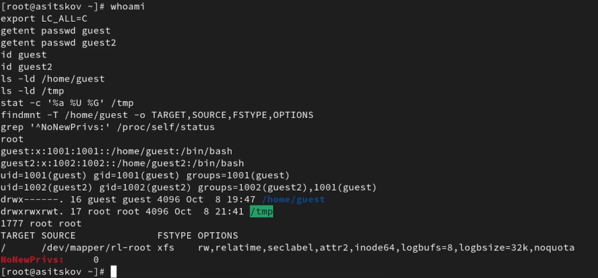{#fig-environment width=100%}

Проверено наличие GCC командами `command -v gcc`, `gcc --version`, `gcc -v`, `whereis gcc`, `whereis g++`. Установлен GCC 11.5.0 (@fig-gcc).

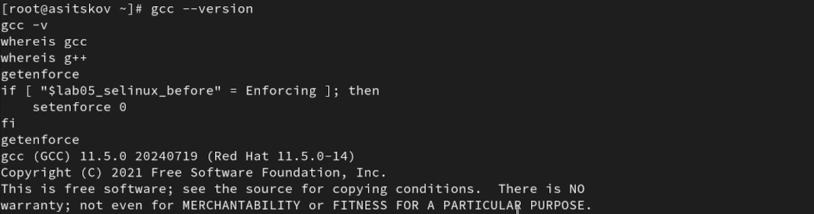{#fig-gcc width=100%}

Исходные значения SELinux (`Enforcing`), `fs.protected_regular` (1) и режима `/home/guest` (700) сохранены в `/root/lab05-state.env`. Для исследования дискреционных прав SELinux временно переведён в `Permissive` командой `setenforce 0` (@fig-selinux).

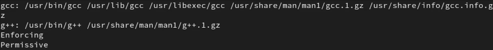{#fig-selinux width=100%}

Административная оболочка открыта командой `sudo -i`: sudo разрешает пользователю с соответствующими полномочиями выполнить команду от другого пользователя, по умолчанию root. Команда `su - guest` переключает сеанс на guest и загружает его окружение. Перед изменениями владельца и специальных битов проверяется `whoami`; возврат в родительскую оболочку выполняется командой `exit`.

## Работа от имени guest

Для создания и запуска программ выбран пользователь guest:

```bash
su - guest
export LC_ALL=C
umask 022
whoami
cd /home/guest
pwd
id
```

Команды подтверждают пользователя guest, каталог `/home/guest` и UID/GID 1001 (@fig-guest).

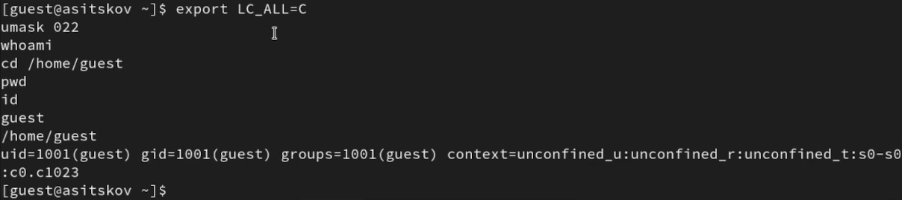{#fig-guest width=100%}

## Программа simpleid: эффективные идентификаторы

В файле `simpleid.c` создана программа с вызовами `geteuid()` и `getegid()`. Исходный текст приведён в разделе «Листинги программ». Выполнены компиляция и сравнение с `id`:

```bash
cat simpleid.c
gcc -Wall -Wextra simpleid.c -o simpleid
ls -l simpleid.c simpleid
./simpleid
id
```

Вывод `uid=1001, gid=1001` совпадает с идентификаторами guest. Исполняемый файл принадлежит guest и имеет обычные права 755 (@fig-simpleid).

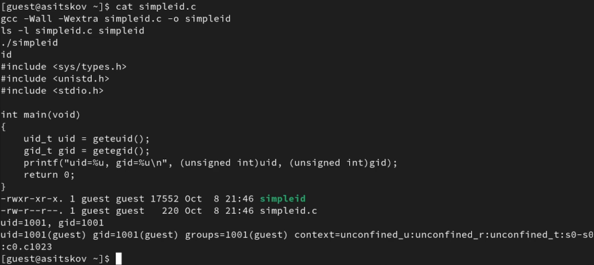{#fig-simpleid width=100%}

## Программа simpleid2: реальные и эффективные ID

Программа дополнена вызовами `getuid()` и `getgid()` и сохранена как `simpleid2.c`:

```bash
gcc -Wall -Wextra simpleid2.c -o simpleid2
ls -l simpleid2
./simpleid2
id
```

Без дополнительных битов обе пары равны 1001: `e_uid=1001, e_gid=1001`, `real_uid=1001, real_gid=1001` (@fig-baseline).

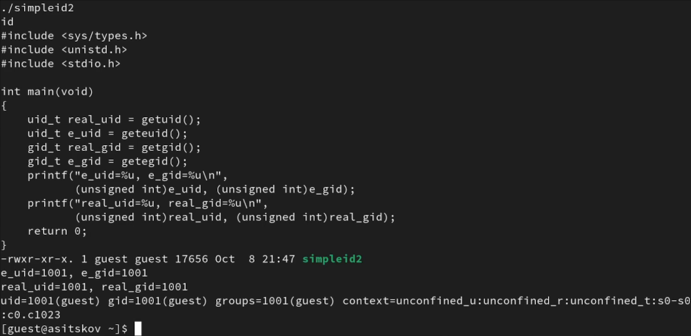{#fig-baseline width=100%}

## Установка SetUID

От root исполняемый файл передан владельцу root и группе guest. После назначения обычных прав установлен SetUID. Затем программа запущена от guest:

```bash
chown root:guest /home/guest/simpleid2
chmod 755 /home/guest/simpleid2
chmod u+s /home/guest/simpleid2
ls -l /home/guest/simpleid2
stat -c '%a %U %G' /home/guest/simpleid2
su - guest
cd /home/guest
./simpleid2
id
```

Режим 4755 отображается как `-rwsr-xr-x`. При запуске guest эффективный UID становится 0, эффективный GID остаётся 1001. Реальные ID сохраняют значение 1001; обычная команда `id` по-прежнему показывает guest (@fig-suid).

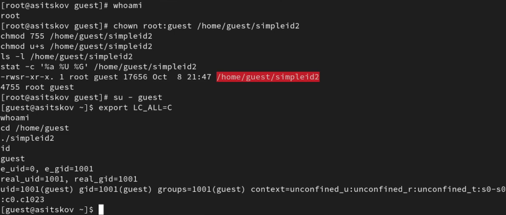{#fig-suid width=100%}

## Отдельная установка SetGID

После возврата к root назначены владелец и группа root. Режим 755 снимает предыдущий SetUID, затем установлен только SetGID:

```bash
chown root:root /home/guest/simpleid2
chmod 755 /home/guest/simpleid2
chmod g+s /home/guest/simpleid2
ls -l /home/guest/simpleid2
stat -c '%a %U %G' /home/guest/simpleid2
su - guest
cd /home/guest
./simpleid2
id
```

Режим 2755 отображается как `-rwxr-sr-x`. У guest изменяется только эффективный GID: он равен 0. Эффективный UID и реальные ID равны 1001 (@fig-sgid).

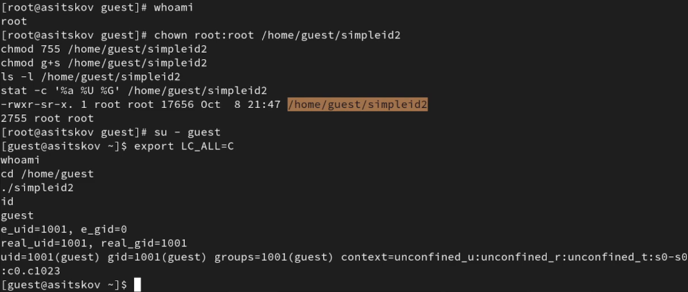{#fig-sgid width=100%}

## Совместная установка SetUID и SetGID

К установленному SetGID от root добавлен SetUID, затем повторён запуск от guest:

```bash
chmod u+s /home/guest/simpleid2
ls -l /home/guest/simpleid2
stat -c '%a %U %G' /home/guest/simpleid2
su - guest
cd /home/guest
./simpleid2
id
```

Режим 6755 отображается как `-rwsr-sr-x`. Эффективные UID/GID равны 0, реальные UID/GID — 1001. Повышение полномочий относится к запущенной программе (@fig-both).

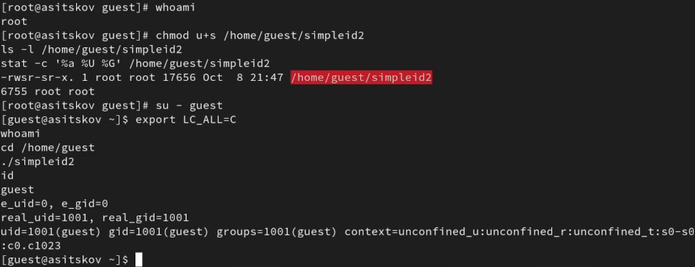{#fig-both width=100%}

## Проверка SetUID на сценарии оболочки

Создан `prog1.sh`, выводящий `id` и `whoami`. После обычного запуска файл передан root и получил SetUID:

```bash
chmod 755 prog1.sh
./prog1.sh
# От root
chown root:root /home/guest/prog1.sh
chmod u+s /home/guest/prog1.sh
ls -l /home/guest/prog1.sh
# От guest
./prog1.sh
```

При `-rwsr-xr-x` и владельце root сценарий выводит UID/GID 1001 и имя guest. SetUID для сценария не изменил полномочия, что соответствует поведению Linux [@linux_execve] (@fig-script).

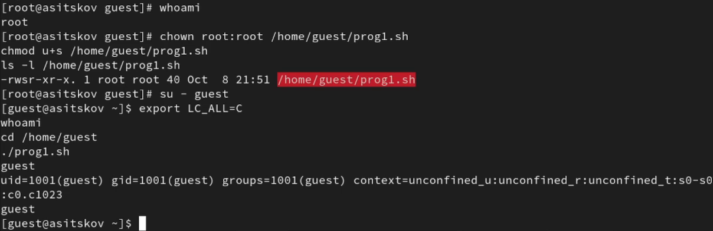{#fig-script width=100%}

## Создание программы чтения файла

В `readfile.c` реализованы открытие файла только для чтения, цикл чтения блоками по 16 байт и вывод в stdout. Проверяются ошибки открытия, чтения, вывода и закрытия. Программа скомпилирована и проверена на доступном исходнике:

```bash
gcc -Wall -Wextra readfile.c -o readfile
nl -ba readfile.c
ls -l readfile readfile.c
./readfile simpleid.c
```

Обычный readfile принадлежит guest и успешно выводит текст simpleid.c (@fig-read-baseline).

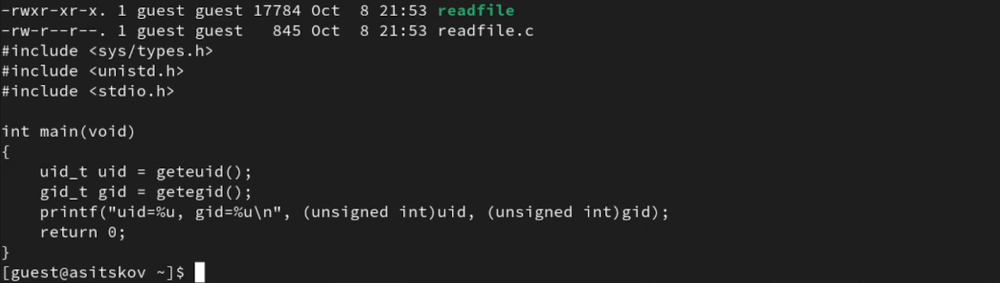{#fig-read-baseline width=100%}

## Ограничение доступа к исходнику

От root исходник readfile.c передан root и получил режим 600. После этого проверки выполнены от guest:

```bash
chown root:root /home/guest/readfile.c
chmod 600 /home/guest/readfile.c
# От guest
cat readfile.c
./readfile readfile.c
echo "readfile exit=$?"
cat /etc/shadow | cut -d: -f1,3-9
```

Обычные cat и readfile не читают закрытый исходник: `Permission denied`, код завершения readfile — 1. Прямое чтение `/etc/shadow` также запрещено. Это исследуемые отказы системы доступа (@fig-denied).

{#fig-denied width=100%}

## Предоставление readfile полномочий владельца root

От root изменены владелец исполняемого readfile и его режим:

```bash
chown root:guest /home/guest/readfile
chmod 755 /home/guest/readfile
chmod u+s /home/guest/readfile
ls -l /home/guest/readfile /home/guest/readfile.c
```

readfile имеет владельца root и режим 4755; исходник остаётся root:root с режимом 600 (@fig-read-suid).

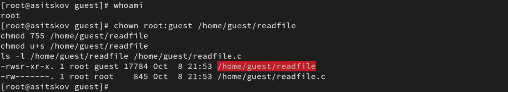{#fig-read-suid width=100%}

## Чтение закрытого исходника через SetUID

От guest программа повторно запущена с тем же закрытым файлом:

```bash
./readfile readfile.c
echo "readfile exit=$?"
```

Исходный текст выведен полностью, код завершения равен 0. Содержимое доступно процессу readfile с эффективным UID владельца root (@fig-read-success).

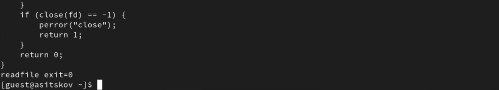{#fig-read-success width=100%}

## Чтение системного файла /etc/shadow

Та же программа проверена на `/etc/shadow`. Для иллюстрации из вывода исключено второе поле, содержащее сведения о паролях. Код завершения проверяется именно у readfile:

```bash
./readfile /etc/shadow | cut -d: -f1,3-9
echo "readfile exit=${PIPESTATUS[0]}"
id
```

Видны записи пользователей, включая asitskov, guest и guest2; readfile завершается с кодом 0. Команда id после запуска сохраняет обычные идентификаторы guest (@fig-shadow).

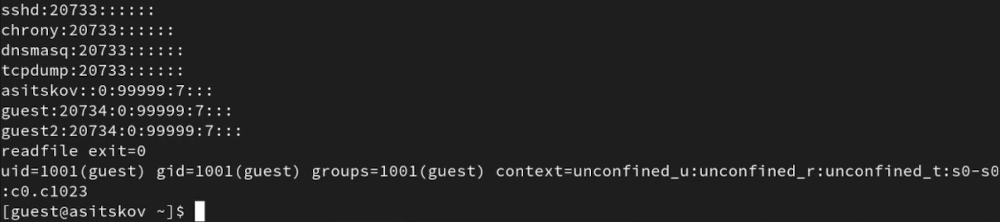{#fig-shadow width=100%}

## Подготовка файла в /tmp

От guest проверены права `/tmp`, создан file01.txt и расширены права записи:

```bash
ls -l / | grep tmp
ls -ld /tmp
umask 022
echo "test" > /tmp/file01.txt
ls -l /tmp/file01.txt
chmod o+rw /tmp/file01.txt
ls -l /tmp/file01.txt
chmod g+rw /tmp/file01.txt
ls -l /tmp/file01.txt
cat /tmp/file01.txt
```

Файл принадлежит guest:guest. Последовательные режимы — 644, 646, 666; содержимое — `test`. Запись группе добавлена потому, что guest2 входит в группу guest (@fig-file-mode).

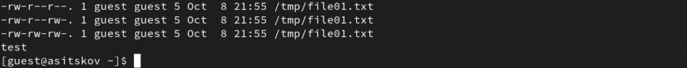{#fig-file-mode width=100%}

## Условия контролируемого опыта sticky bit

После первоначальной проверки от root временно отключена дополнительная защита открытия файлов. Sticky bit остаётся установленным:

```bash
sysctl -w fs.protected_regular=0
sysctl fs.protected_regular
ls -ld /tmp
# От guest: подготовка одного и того же начального содержимого
echo "test" > /tmp/file01.txt
chmod 666 /tmp/file01.txt
```

Параметр равен 0; `/tmp` имеет режим 1777 (`drwxrwxrwt`). Для обеих серий используется файл guest с режимом 666 (@fig-controlled).

{#fig-controlled width=100%}

## Чужой файл в каталоге со sticky bit

От guest2 выполнены чтение, дозапись, перезапись и попытка удаления:

```bash
whoami
cat /tmp/file01.txt
echo "test2" >> /tmp/file01.txt
cat /tmp/file01.txt
echo "test3" > /tmp/file01.txt
cat /tmp/file01.txt
command rm /tmp/file01.txt
ls -l /tmp/file01.txt
```

Чтение и обе операции записи разрешены: после дозаписи видны test и test2, после перезаписи — test3. Удаление возвращает `Operation not permitted`; файл сохраняется у владельца guest (@fig-sticky).

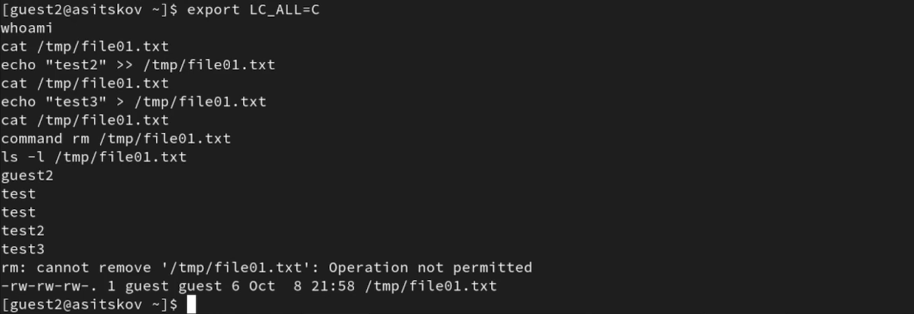{#fig-sticky width=100%}

## Снятие sticky bit

Перед повтором guest восстановил содержимое test и режим 666. Затем root снял sticky bit с каталога:

```bash
chmod -t /tmp
ls -ld /tmp
stat -c '%a %U %G' /tmp
```

Режим `/tmp` стал 777 (`drwxrwxrwx`), владелец и группа остались root (@fig-no-sticky).

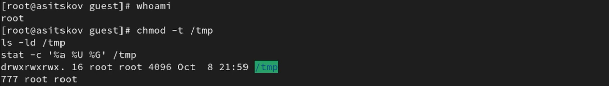{#fig-no-sticky width=100%}

## Повтор операций без sticky bit

От guest2 повторён тот же набор операций с файлом guest:

```bash
cat /tmp/file01.txt
echo "test2" >> /tmp/file01.txt
cat /tmp/file01.txt
echo "test3" > /tmp/file01.txt
cat /tmp/file01.txt
command rm /tmp/file01.txt
echo "rm exit=$?"
ls -l /tmp/file01.txt
```

Чтение, дозапись и перезапись проходят. Удаление также успешно: `rm exit=0`; следующая проверка сообщает `No such file or directory`. Изменение результата удаления связано со снятием sticky bit (@fig-deleted).

{#fig-deleted width=100%}

## Восстановление системы

От root восстановлены сохранённые настройки и сняты дополнительные биты с учебных программ:

```bash
source /root/lab05-state.env
chmod 1777 /tmp
sysctl -w "fs.protected_regular=$lab05_protected_regular_before"
chown guest:guest /home/guest/simpleid2 /home/guest/readfile \
    /home/guest/prog1.sh /home/guest/readfile.c
chmod 755 /home/guest/simpleid2 /home/guest/readfile /home/guest/prog1.sh
chmod 600 /home/guest/readfile.c
chmod "$lab05_home_mode_before" /home/guest
setenforce 1
getenforce
sysctl fs.protected_regular
ls -l /home/guest/simpleid2 /home/guest/readfile /home/guest/prog1.sh \
    /home/guest/readfile.c
ls -ld /home/guest
```

Подтверждены `/tmp` 1777, protected_regular=1, SELinux Enforcing, `/home/guest` 700. Программы принадлежат guest и имеют режим 755 без SetUID/SetGID; readfile.c — guest:guest 600 (@fig-restore).

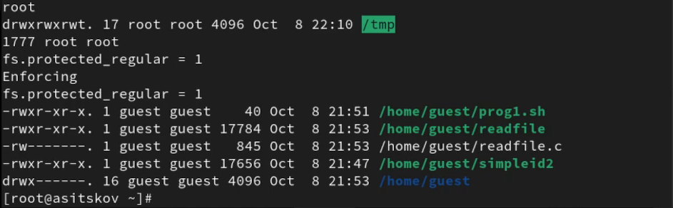{#fig-restore width=100%}

## Проверка идентификаторов после восстановления

От guest повторно запущена simpleid2:

```bash
whoami
cd /home/guest
./simpleid2
id
```

Реальные и эффективные UID/GID снова равны 1001 (@fig-restored-id).

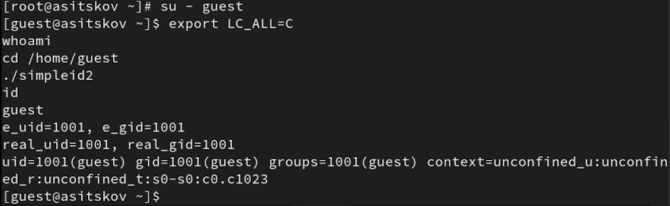{#fig-restored-id width=100%}

## Сохранение исходников

В домашнем каталоге guest создан и проверен архив четырёх исходных файлов. Затем выполнен выход к основному пользователю:

```bash
tar -czf lab05-sources.tar.gz simpleid.c simpleid2.c readfile.c prog1.sh
tar -tzf lab05-sources.tar.gz
ls -lh lab05-sources.tar.gz
ls -ld /tmp
exit
whoami
exit
whoami
```

Архив содержит три C-файла и сценарий prog1.sh; `/tmp` имеет sticky bit. В конце сеанс возвращён к asitskov (@fig-archive).

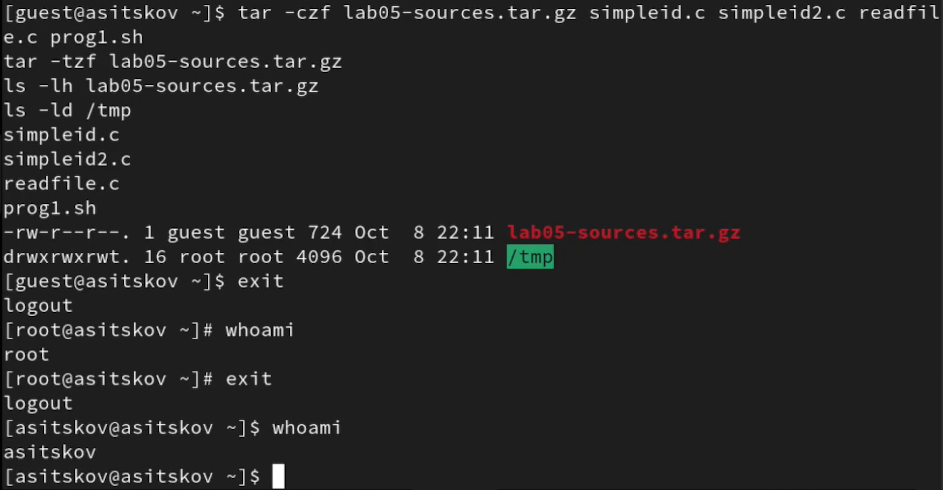{#fig-archive width=100%}

# Анализ результатов

## Реальные и эффективные идентификаторы

Результаты запусков simpleid2 от guest сведены в @tbl-ids. Изменяется только эффективный ID, соответствующий установленному биту; реальные ID во всех опытах сохраняются.

| Режим | Владелец:группа | Реальный UID | Эффективный UID | Реальный GID | Эффективный GID |
|:--|:--|--:|--:|--:|--:|
| 755 | guest:guest | 1001 | 1001 | 1001 | 1001 |
| 4755 | root:guest | 1001 | 0 | 1001 | 1001 |
| 2755 | root:root | 1001 | 1001 | 1001 | 0 |
| 6755 | root:root | 1001 | 0 | 1001 | 0 |

: Идентификаторы simpleid2 при запуске от guest {#tbl-ids}

Различие между программой и командой `id` объясняется тем, что `id` запускается отдельным процессом из обычной оболочки guest. Программа SetUID не меняет пользователя этой оболочки. Сценарий с тем же битом остаётся непривилегированным.

Второй опыт демонстрирует практическое следствие: readfile с владельцем root и SetUID читает файл, недоступный обычному guest. Такой исполняемый файл требует строгого ограничения назначения и проверки входных данных; произвольное чтение путей может раскрывать закрытые сведения.

## Влияние sticky bit

В @tbl-sticky сравнивается файл guest:guest с режимом 666 при запуске операций пользователем guest2. В контролируемой серии protected_regular=0; между сериями изменён только sticky bit каталога и восстановлено начальное содержимое файла.

| Операция guest2 | /tmp 1777, с t | /tmp 777, без t |
|:--|:--|:--|
| Чтение | Разрешено | Разрешено |
| Дозапись через >> | Разрешена | Разрешена |
| Перезапись через > | Разрешена | Разрешена |
| Удаление чужого файла | Запрещено | Разрешено |

: Операции с чужим файлом при установленном и снятом sticky bit {#tbl-sticky}

Право записи в файл и право удалить его имя из каталога проверяются по разным правилам. Sticky bit защищает чужую запись каталога, но не заменяет права на содержимое файла. Для общего `/tmp` режим 1777 препятствует удалению чужих файлов обычными пользователями; режим 777 такой защиты не даёт.

# Листинги программ

Приведены исходные тексты программ, использованных в опытах. Все C-программы собираются GCC; сценарий запускается оболочкой Bash.

## simpleid.c

```c
#include <sys/types.h>
#include <unistd.h>
#include <stdio.h>

int main(void)
{
    uid_t uid = geteuid();
    gid_t gid = getegid();
    printf("uid=%u, gid=%u\n",
           (unsigned int)uid, (unsigned int)gid);
    return 0;
}
```

## simpleid2.c

```c
#include <sys/types.h>
#include <unistd.h>
#include <stdio.h>

int main(void)
{
    uid_t real_uid = getuid();
    uid_t e_uid = geteuid();
    gid_t real_gid = getgid();
    gid_t e_gid = getegid();
    printf("e_uid=%u, e_gid=%u\n",
           (unsigned int)e_uid, (unsigned int)e_gid);
    printf("real_uid=%u, real_gid=%u\n",
           (unsigned int)real_uid, (unsigned int)real_gid);
    return 0;
}
```

## readfile.c

```c
#include <fcntl.h>
#include <stdio.h>
#include <sys/stat.h>
#include <sys/types.h>
#include <unistd.h>

int main(int argc, char *argv[])
{
    unsigned char buffer[16];
    ssize_t bytes_read;
    int fd;
    if (argc != 2) {
        fprintf(stderr, "Usage: %s FILE\n", argv[0]);
        return 2;
    }
    fd = open(argv[1], O_RDONLY);
    if (fd == -1) {
        perror("open");
        return 1;
    }
    while ((bytes_read = read(fd, buffer, sizeof(buffer))) > 0) {
        if (fwrite(buffer, 1, (size_t)bytes_read, stdout)
            != (size_t)bytes_read) {
            perror("fwrite");
            close(fd);
            return 1;
        }
    }
    if (bytes_read == -1) {
        perror("read");
        close(fd);
        return 1;
    }
    if (close(fd) == -1) {
        perror("close");
        return 1;
    }
    return 0;
}
```

## prog1.sh

```bash
#!/bin/bash
/usr/bin/id
/usr/bin/whoami
```

# Выводы

На практике исследованы реальные и эффективные идентификаторы процессов Linux. SetUID изменяет эффективный UID по владельцу исполняемого файла, SetGID — эффективный GID по группе, оба бита действуют совместно. Реальные идентификаторы запускающего пользователя сохраняются. Сценарий оболочки с SetUID выполняется с обычными идентификаторами guest.

Обычное чтение закрытого исходника и `/etc/shadow` запрещено; после назначения программе readfile владельца root и SetUID чтение проходит успешно. Это показывает влияние полномочий процесса на доступ к файлам.

Sticky bit в общем каталоге запрещает обычному пользователю guest2 удалять файл guest, хотя права 666 позволяют изменять его содержимое. После снятия sticky bit удаление разрешено. По завершении восстановлены настройки защиты и обычные права учебных программ.

# Список литературы {.unnumbered}

::: {#refs}
:::
